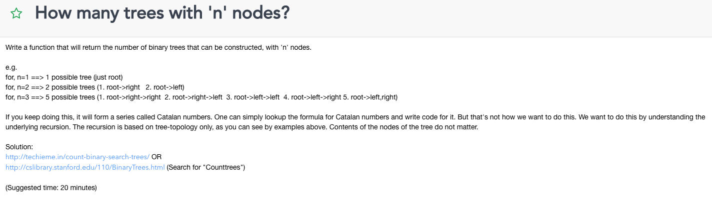
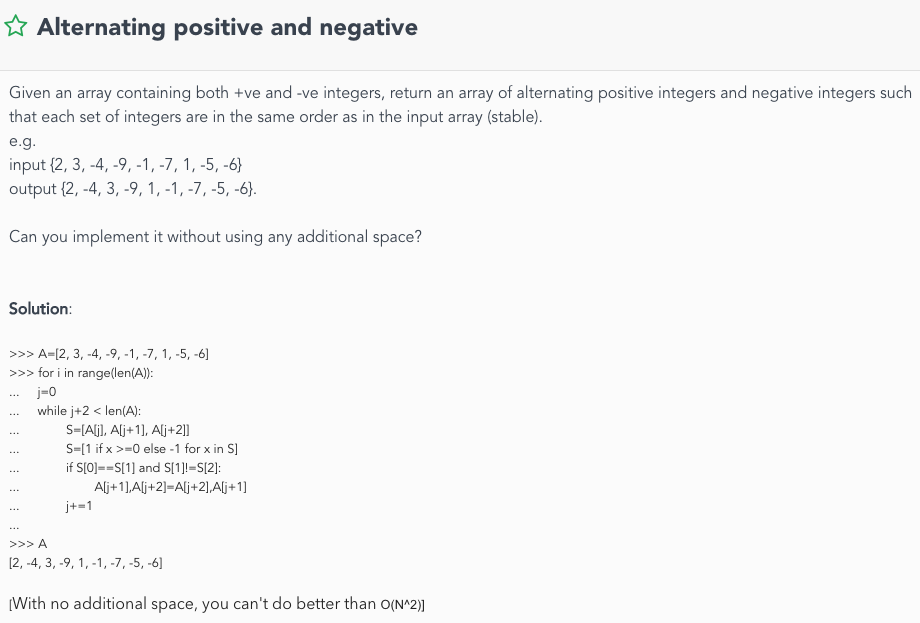
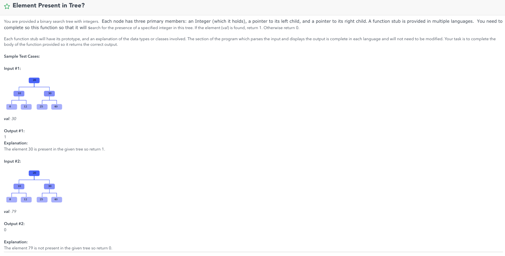

scratch
# HW1
## Zip


## Sliding Window Maximum


## Clone a special list


## Merge a sorted linked list


## SuperStack


## Design and implement LRU cache


## Alternative Node Split


## Find the middle element in a singly linked list


## Valid matching params


## Longest substring with matching parans


## Swap kth nodes in Linked List


## Reverse a linked list in groups


## Duplicates in a linked list


## Implement Min Stack


# HW1 test


# HW2
## Tower of Hanoi


## Wildcard


## ExpressionEvaluator


## Palindromic Decomposition


## N Queens


## Subset of a Set


## Diameter of a tree


## Double Power

#### Ideas
- Check %2 to halve amount of computation

## CountTrees

#### Ideas
- Let f(n) be the # of binary trees for n nodes
- Therefore, f(0) = 1, f(1) = 1, f(2) = 2
- Number of binary trees is the sum of possible (left subtrees of size i, and
right subtress of size (n-1-i)
- Basically a summation of n for j = 0l where (n-j-1) * j

# HW2 Test

## Sum of integers


## Find all cominbations of well formed brackets


## Recursive reverse of a string


# Object Modeling


# HW3

## Is BST


## Merge trees


## Post Order Traversal without Recursion


## Print all paths in a tree


## Rebuild the tree


## LCA


## Tree Iterator


## BST to double ll


## Clone a binary tree


## Populate sibling pointers


## Flip a tree


## Largest binary tree


## Single value tree


## Written Question


# HW3 Test


## HW 4


## HW 4 Test


## HW 5


## HW 5 Test


ANS


## HW 6





## HW 6 Test


## HW 7


## HW 7 Test


## HW 8


## HW 8 Test


# Pramp

## Interview 1 Instructor
Smallest Substring of All Characters

Given an array with unique characters arr and a string str, find the smallest substring of str containing all characters of arr.

Example:
arr: [x,y,z], str: xyyzyzyx
result: zyx

Implement your solution and analyze the runtime complexity

Hints & Tips
If your peer is stuck, ask how can we determine if a given substring is valid (all chars from set are in it) and then ask how to apply that to a solution

If your peer is using a naive solution of checking all possible substrings, try to ask how can you avoid duplicate work

Make sure proper initializations are made

Watch for unnecessary variables and steps

For other solutions, make sure that any permutation of the characters in set can be found by the algorithm

make sure your peer understand why we should increase tail only after head is increased

Solution
We iterate the string from left to right, while using two indices - tailIndex and h.
At each iteration step, we examine the temp substring  [str.charAt(tailIndex), str.charAt(tailIndex+1) ..., str.charAt(h)]  and keep a copy of the shortest vaild substring we've seen so far.

To examine substrings we use 2 counters:
uniqueCounter (integer) - number of unique characters of arr in our temp substring
countMap (map/object/associative array - depends of your language of choice) - number of occurrences of each char from arr in our substring

function getShortestUniqueSubstring(arr, str):
   t = 0
   result = null
   uniqueCounter = 0
   countMap = new Map()
   # initialize countMap:
   for i from 0 to length(arr)-1:
      countMap.setValueOf(arr[i], 0)
   # scan str
   for h from 0 to length(str)-1:
      # handle the new head
      head = str.charAt(h)
      if countMap.keyExists(head) == false:
         continue
      headCount = countMap.getValueOf(head)
      if headCount == 0:
         uniqueCounter = uniqueCounter + 1
      countMap.setValueOf(head, headCount + 1)   
      # push tail forward
      while uniqueCounter == length(arr):
         tempLength = h - t + 1
         if tempLength == arr.length:
            return str.substring(t, h)
         if (!result or tempLength < length(result)):
            result = str.substring(t, h)
         tail = str.charAt(t)
         if countMap.keyExists(tail):
            tailCount = countMap.getValueOf(tail) - 1
            if tailCount == 0:
               uniqueCounter = uniqueCounter - 1
            countMap.setValueFor(tail, tailCount)
         t = t + 1
   return result
Runtime Complexity: we're doing a linear iteration of both str and arr of lengths n and m respectively, so the runtime complexity is a linear O(n+m).

Space Complexity: depends of your implementation for the mapping, but generally: we're using countMap with m keys (the length of arr) plus few constant size counters - O(m) space complexity.


---
## Interview 1 Interviewee
The "Award Budget Cuts" Problem

The awards committee had planned to give n research grants this year, out of a its total yearly budget.
However, the budget was reduced to b dollars. The committee members has decided to affect the minimal number of highest grants, by applying a maximum cap c on all grants: every grant that was planned to be higher than c will now be c dollars.
Help the committee to choose the right value of c that would make the total sum of grants equal to the new budget.

Given an array of grants g and a new budget b, explain and code an efficient method to find the cap c. Assume that each grant is unique.
Analyze the time and space complexity of your solution.

??? SOLUTION?
---

## Interview 2 Instructor
K-Messed Array Sort

Given an array arr of length n where each element is at most k places away from its sorted position,
Plan and code an efficient algorithm to sort arr.
Analyze the runtime and space complexity of your solution.

Example: n=10, k=2. The element belonging to index 6 in the sorted array, may be at indices 4, 5, 6, 7 or 8 on the given array.

Hints & Tips
Try to help your peer think about the advantages of this nearly k-sorted array. Then ask how can it be useful.

As a hint ask your peer, for the 0-index place on the array, how far can the item that belongs there be, and how can that be generalized (building the iterative step).

This question is a good opprtunity to check if your peer remebers what are insertion sort and heap sort, and for you both to brush up on that. A good source to get that covered is Sorting Algorithm article on Wikipedia.

If your peer does not know about insertion sort or heap sort, make sure his knowledge section on the interview feedback reflect that

To get the best feedback rating on the problem solving section your peer should plan, explain and execute an O(n • log k) solution

If min-heap doesn't exist on the interview's coding language let your use a min-heap object as if it exists:
Valid operations are new MinHeap(), extractMin() and insert()

Watch for correct calculations and usage of array indices

If your peer is completely stuck, help the thought process by asking what can you do with a sliding window of size k+1

If relevant data structures (heap or others used by your peer) don't exist in your language of choice, you can assume their existence once your peer explain their concepts and operations and you both agree on its API.

Solution
The suboptimal approach to solve is by using Insertion Sort:
We iterate the arr from left to right:
On each iteration we bring arr[i] to its place in the subarray arr[0,1,2 ... i], by shifting any subarray elements that are bigger than A[i] one place right.

function insertionSort(arr):
   for i from 1 to arr.length-1:
      x = arr[i]
      j = i-1
      while (j >= 0 and arr[j] > x):
         arr[j+1] = arr[j]
         j--
      arr[j+1] = x
   return arr
Runtime complexity: iteration over array of length n and switching at most k pairs for each iteration (by definition of the given array), takes O(n • k).
If k is constant and relatively small we can argue that it's actually close to a linear O(n) case.

Space complexity: constant O(1), all we need is 2 indices.


However, we can do better:

If we use a modified Heap Sort we can get better runtime complexity:
We define a virtual 'sliding window' of from the first k+1 elements of arr.
First we build a min heap from the elements in the window.
Then, we start sliding: on each step we extract the minimum from the heap, move the window one place right, place the min we've extracted into index that is now left to the window and insert the new element at the end of the window to the heap. We repeat that until the window reaches the end of the array, then we extract the minimum from the heap and place it on the next index of arr, until the heap is empty.

function kHeapSort(arr, k)
   h = new MinHeap()
   n = length(arr)
   for i from 0 to k:
      h.insert(arr[i])
   for i from k+1 to n-1:
      arr[i-(k+1)] = h.extractMin()
     h.insert(arr[i])
   for i from 0 to k:
     arr[n-k-1 + i] = h.extractMin()
   return arr
Runtime complexity:
Building a heap takes linear O(k) for k+1 elements.
Operating the heap later involves extracting min on a min-heap / inserting to the heap. These actions take O(log k) each. We do at least one of these actions n times, so the cost here is O(n • log k).
the overall runtime complexity of the heap solution is O(n • log k). again, if k is constant, we may argue the complexity is close to linear.

Space complexity:
we need to hold a min heap of  k+1 elements.
Since a heap is usually implemented with an array the space complexity is O(k+1).
However, we can implement and maintain the heap manually on our conceptual sliding window subarray. If we handled right, it can lead us to a constant O(1) space complexity.
---

## Interview 2 Interviewee

The "Quad Combination" Problem

Given an array of numbers arr and a number S, find 4 different numbers in arr that sum up to S.

Write a function that gets arr and S and returns an array with 4 indices of such numbers in arr, or null if no such combination exists.
Explain and code the most efficient solution possible, and analyze its runtime and space complexity.

Solution

The naive solution is to iterate on every possible combination of 4 numbers from arr until the required combination if found. Using 4 nested loop involves O(n4) time complexity and O(1) space complexity. This is quite inefficient.

We can do better, if we look at all the pairs in arr, and then try to build the sum S from 2 different pairs.
First, we iterate over all the possible pairs in arr with 2 nested loops and hash each pair by its sum. Then, for each pairSum in the pairs hash table, we look for its complement S - pairSum. When we find two pairs that sum up to S, we need to check that these pairs are drawn from 4 different indices in arr (in other words: that no number is used twice to reach the desired sum).

function findArrayQuadCombination(arr, S):
   if (arr == null OR S == null):
      return null
   n = length(arr)
   if (n < 4):
      return null
   # hashing implementation language dependent:
   pairHash = new HashTable()
   for i from 0 to n-1
      for j from i+1 to n-1
         if !pairHash.isMapped(arr[i]+arr[j]):
            pairHash.map(arr[i]+arr[j], [])
         pairHash.get(arr[i]+arr[j]).push([i, j])

   for pairSum in pairHash.getKeys()
      if pairHash.isMapped(S - pairSum):
         pairsA = pairHash.get(pairSum)
         pairsB = pairHash.get(S - pairsSum)
         combination = find4Uniques(pairsA, pairsB)
         if (combination != null):
            return combination
   return null

# Helper function.
# Gets 2 arrays of sub-arrays of 2 numbers
# Gets 4 unique numbers, from 2 sub-arrays of different arrays
function find4Uniques(A, B):
   lenA = length(A)
   lenB = length(B)
   for i from 0 to lenA-1:
      for j from 0 to lenB-1:
         if ( A[i][0] == B[j][0] OR A[i][1] == B[j][1] OR
              A[i][0] == B[j][1] OR A[i][1] == B[j][0] ):
            continue
         else:
            return [A[i][0], A[i][1], B[j][0], B[j][1]]
   return null

Time Complexity: Let n be the length or arr. Hashing all pairs in arr by their sum and iterating over all sums and their complements takes O(n2) time (n2 pairs and constant number of actions for each). Uniqueness check for all indices of the pairs of sums that adds up to S until a valid combination is found, is also O(n2) (checking at most n2 pairs with 4 comparisons for each). Overall: quadratic O(n2) time complexity.

Space Complexity: n2 pairs have up to n2 different sums. Hashing them takes O(n2) space complexity.
---

## Interview 3 Interviewee

function findComplementingWeights(arr, limit):
  h = new hashTable()
  for (index, w) in arr:
     complementIndex = h.findKey(limit - w)
     if (complementIndex != null):
        return [index, complementIndex]
     else:
        h.insert(w, index)
  return -1

---


## Interview 4 Interviewee

class Pramp {

   static void print(int[][] M) {
      printHelper(M, M[0].length, M.length, 0, 0);
   }

   static void printHelper(int[][] M, int n, int m, int row, int col) {

      if (row > m / 2 || col > n / 2) {
         return;
      }

      /*
      int left = 0, right = M[0].length-1, top = 0, bottom = M.length-1;

      for (int j=left; j<=right; j++) {
         print(M[0][j]);
      }

      top ++;
      for (int i=top; i<=bottom; i++)
         print(M[][]);

      right --;


      */

      // Print top
      for (int j = row; j < n - col; j++) {
         System.out.println(M[row][j]);
      }

      // Print right column
      for (int i = row + 1; i < m - (row + 1); i++) {
         System.out.println(M[i][col]);
      }

      // Print bottom
      for (int j = n - col - 1; j >= col; j--) {
         System.out.println(M[m-row-1][j]);
      }

      // Print left column
      for (int i = m - row; i > row; i--) {
         System.out.println(M[i][col]);
      }

      printHelper(M, n, m, row + 1, col + 1);
   }

   public static void main(String[] args) {
      String pramp = "Practice Makes Perfect";
      System.out.println(pramp);
   }
}*/

---

## Interview 5 Interviewee

islands question

---

## Interview 6 Interviewee

arrays question


## Interview 7 Interviewee

The "Word Count Engine" Problem

Implement a document scanning engine that receives a text document doc and returns a list of all unique words in it and their number of occurrences, sorted by the number of occurrences in descending order.

Example:
for doc: "practice makes perfect. get perfect by practice. just practice!"
the engine returns the list: { practice: 3, perfect: 2,  makes: 1, get: 1, by: 1, just: 1 }.

The engine should ignore punctuation and white-spaces.
Find the minimal runtime complexity and analyze it.

static class Result {
   String word;
   int count;
   public Result(String word, int count) {
      this.word = word;
      this.count = count
   }
}

static List<Result> wordCount(List<String> doc) {

   List<Result> result = new ArrayList<>();

   Map<String, Integer> textToCount = new HashMap<>();
   TreeMap<Integer, List<String>> reverseMap = new TreeMap<>();
   for (String word : doc) {
      if (!textToCount.containsKey(word)) {
         textToCount.put(word, 0);
      }

      int currCount = textToCount.get(word);
      int newCount = currCount + 1;

      if (!reverseMap.containsKey(newCount)) {
         reverseMap.put(newCount, new ArrayList<>());
      }

      reverseMap.get(newCount).add(word);
      textToCount.put(word, textToCount.get(word) + 1);
   }      

   // Output
   Set<String> printed = new HashSet<>();
   for (Integer count : reverseMap.descendingKeySet()) {
      List<String> words = reverseMap.get(count);
      for (String word : words) {
         if (!printed.contains(word)) {
            result.add(new Result(word, count));      
            printed.add(word);
         }
      }

   }
   return result;
}

---

## Interviewee 8

The "Busiest Time in The Mall" Problem

The mall management is trying to figure out what was the busiest moment in the mall in the last year.
You are given data from the door detectors: each data entry includes a timestamp (seconds in Unix Epoch format), an amount of people and whether they entered or exited.

Example of a data entry:
{ time: 1440084737,  count: 4,  type: "enter" }

Find what was the busiest period in the mall on the last year. Return an array with two Epoch timestamps representing the beginning and end of that period. You may assume that the data your are given is accurate and that each second with entries or exits is recorded. Implement the most efficient solution possible and analyze its time and space complexity.


---

## Interviewee 9
The "BST Successor Search" Problem

Given a node n in a binary search tree, explain and code the most efficient way to find the successor of n.
Analyze the runtime complexity of your solution.

---

## Interviewee 10
Dictionary print thing

Given a node n in a binary search tree, explain and code the most efficient way to find the successor of n.
Analyze the runtime complexity of your solution.


---

# Interview.io

# Steps question, recursively

# generate prime factorization


---

# Divya 1

pacific, atlantic, dfs
Given BST and a target value. Count the number of pairs of values which sum to the target value.

Given BST and a target value. Count the number of pairs of values which sum to the target value.

Ex:          0
          -2   4
         -2   4  5
        -3        6
                    11
   target = 4
   output: 2 (0,4) (6,-2)


   // n is # nodes
   // For each node in tree: O(n)
   //     val = node.val
   //     Find if target - val exists O(logn)
   // Final dedup step, O(n)

   // Runtime : O(nlogn)
   // Space: O(n^2) -- due to no dedup

   // Traverse tree once, both ends
   // (-3, 11), t = 4,
   // (-3, 11)

   // Case 1: assuming no duplicates, move both pointers to sucessor and predecessor
   // Case 2: val > targer, where val is sum of pointers
   // Case 3:


   // Recursive function that returns leftmost node, rightmost node in an LL
   // Base case: single BST leaf node: {node, node}
   //

static class Spine {
    Node precursor;
    Node successor;
}


Ex:          0
          -2   4
         -2   4  5
        -3        6
                    11                    


static Spine convertBST(Node n) {
    if (n == null) {
        return null;
    }

    if (n.left == null && n.right == null) {
        return new Spine(n, n);
    }

    Spine right = convertBST(n.right);
    Spine left = convertBST(n.left);

    // Link the spines up
    n.left = left.sucessor;
    if (left != null && left.sucessor != null) {
        left.sucessor.right = n;
    }
    n.right = right.precursor;
    if (right != null && right.precursor != null) {
        right.precursor.left = n;
    }

    // Return the linked up spine
    return new Spine(left.precursor, right.sucessor);
}

// Returns the head of the new LL
static Spine convertToLL(Node n) {
    return convertBST(n); // head and tail of LL
}


l                  r
-3 -2 -2 0 4 5 6 11


-4


target = 8
-3, 11, val = 8, count = 1
-2, 6, val = 4, count = 1,
-2, 6, val = 4, count = 1,
0, 6, val = 6, count = 1,
4, 6, val = 10, count = 1,
4, 5, val = 9, count = 1,
4, 4, val = 8, count = 2,


static int countPairs(Node root, int target) {
    if (root == null) {
        throw new IllegalArgumentException();
    }

    int count = 0;
    Spine spine = convertToLL(root);
    Node leftN = spine.precursor;
    Node rightN = spine.sucessor;

    while (leftN != rightN && rightN.right != leftN) {
        int val = leftN.val + rightN.val;

        // Move both pointers inward if val == target
        if (val == target) {
            count++;
            leftN = leftN.right;
            rightN = rightN.left;
        } else if (val < target) {
            // Increase val by moving left pointer inward
            leftN = leftN.right;
        } else {
            // Decrease val by moving right pointer inward
            rightN = rightN.left;
        }
    }
    return count;
}


$$
R_{\mu}
$$

```java
static String[] palindromicDecomposition(String str) {

    Deque<Interval> curr = new LinkedList<>();
    List<List<String>> results = new LinkedList<>();

    generatePalindromes(results, curr, 0, str);

    List<String> result = new LinkedList<>();
    for (List<String> l : results) {
        Iterator<String> it = l.iterator();
        StringBuilder builder = new StringBuilder();
        while(it.hasNext()) {
            builder.append(it.next());
            if (it.hasNext()) {
                builder.append('|');
            }
        }
        result.add(builder.toString());
    }

    return result.toArray(new String[result.size()]);
}
```

```
There are m boys and n girls at a dance, each boy wants to dance with a girl who is strictly shorter than him.
 A girl can dance with only one boy and vice-versa.
 Given an array b of length m with the heights of all the boys and an array g of length n with the heights of all girls
 tell whether it is possible for all boys to get a girl

 // Condition all boys to get a girl
 // False if m > n

 // Simple way:
 // Sort boys by hieght
 // Sort girls by height
 // Iterate over both lists:
 // If b[i] > g[j]: continue iterating, increment both
 // if not: false


 g=[2,3,3,5,6,8]
 b=[3,3,3,3,8,5]

 g=[2,3,5,6]
 b=[3,8,5,4]


 // partition returns highest index >= partition val

 b=[5000]
 g=[1,1]

 // Runtime?
 // Partition on girls array O(m)
 // Select O(m)
 // Total: boys * selectK: O(n + m^2)


private static boolean canDance(int[] boys, int[] girls) {
    for (int i = 0; i < boys.length; i++) {
        if (!(selectK(girls, i, girls.length, i) < boys[i])) {
            return false;
        }
    }
    return true;
}'

 b=[2||2,3,5,5]
 g=[1||1,1,1,3]

 selectK(g, 0, g.length, 0)
 g=[1,1,1,1,3]
 pivotIdx = 3
 selectK(g, 0, 2, 0)
 g=[1,1,1||1,3]
 pivotIdx = 2
 selectK(g, 0, 1, 0)
 g=[1,1||1,1,3]
 pivotIdx = 1
 selectK(g, 0, 0, 0)
 pivotIdx = 0
 return 1


// Returns kth value in arr.
private static int selectK(int[] arr, int from, int to, int k) {

    int pivotIdx = choosePartitionIdx(arr, from, to);
    swap(arr, from, pivotIdx);

    pivotIdx = partition(arr, from, to);

    if (pivotIdx == from + k) {
        return arr[pivotIdx];
    } else if (k + from < pivotIdx) {
        return selectK(arr, from, pivotIdx - 1, k);
    } else {
        return selectK(arr, pivotIdx + 1, to, k - pivotIdx);
    }
}

private static int choosePartitionIdx(int[] arr, int from, int to) {
    return from;
}


arr: [3,2,1,4,5]

Iteration 1:
    pivotVal: 3, low: 0, high: 4, low = 3
    pivotVal: 3, low: 0, high: 4, high = 2
    [1,2,3,4,5]

return 2;


// Returns partitioned index
private static int partition(int[] arr, int from, int to) {
    int low = from;
    int high = to;
    int pivotVal = arr[from];
    while (low <= high) {
        while (arr[low] <= pivotVal && low < to) {
            low++;
        }
        while (arr[high] > pivotVal) {
            high--;
        }

        if (low <= high) {
            swap(arr, low, high);
            low++;
            high--;
        }
    }

    // Finally swap pivot into partition location
    swap(arr, from, high);
    return high;
}

private static void swap(int[] arr, int a, int b) {
    int tmp = arr[a];
    arr[a] = arr[b];
    arr[b] = tmp;
}


 2->find boy that should be at index 2 of the sorted version of boys


 // quickselect on boys
 // pivot 3, pivot around 3, b: [3,8,5,4], i = 0;
 // pivor 3 (from boy pivot val) in girls, [2,3,5,6], j = 1,
 // check value at girls pivot point.
 // if value is matched:
 //     find predecessor index (2,3,3,3,3)
 // match exists since j >= i

 // Idea quickselect
 // i is index into b
 // quickselect returns index in provided arr partitioned around value provided
 i = 0, b[i] = 3, quickselect(g, 3) = 1, left partition + equal


 // not soreted: iterat over all gs
 // bubaryt search


b = [1,3,5,7,8]
g = [2,5,6,7,8]
// False as m > n


O(M^2) M is length of boys heights array.
n >= m
O(NLOGM)


Runtime: O(mlogm + nlogm + m)
// Definitely need to sort all boys
// Don't need to sort all girls, sorted ordet of shortest m girls

```

```
import java.io.*;
import java.util.*;

/*
 * To execute Java, please define "static void main" on a class
 * named Solution.
 *
 * If you need more classes, simply define them inline.
 */

class Solution {
  public static void main(String[] args) {
    System.out.println(decimal(1,3));
    System.out.println(decimal(2,4));
    System.out.println(decimal(22,7));
  }


  private static String decimal(int numerator, int denominator) {
    // Validate that denominator is not 0
    if (denominator == 0) {
      throw new IllegalArgumentException("0 is invalid denominator");
    }

    // Calculate number before decimal
    int beforeDecimal = 0;
    while (numerator >= denominator) {
      numerator -= denominator;
      beforeDecimal++;
    }

    // No remainder
    if (numerator == 0) {
      return beforeDecimal + ".(0)";
    }

    // Deal with remainder
    Set<Integer> cache = new HashSet<>();
    return beforeDecimal + ".(" + remainderString(cache, numerator, denominator) + ")";
  }


  private static String remainderString(Set<Integer> calculatedRemainders, int sum, int divisor) {

    // Terminating condition: we've calculated this remainder before.
    if (calculatedRemainders.contains(sum)) {
      return "";
    }

    // Record that we've calcualted this remainder.
    calculatedRemainders.add(sum);

    int remainder = sum % divisor;

    // How many remainders can fit into our divisor?
    int numRemainder = 0;
    sum = 0;
    while (sum < divisor) {
      sum += remainder;
      numRemainder++;
    }

    // divisor 4, remainder 2, sum 0, numRemainder 0
    // divisor 4, remainder 2, sum 2, numRemainder 1
    // divisor 4, remainder 2, sum 4, numRemainder 2

    int newRemainder = sum % divisor;
    if (newRemainder == 0) {
      return String.valueOf(10 / numRemainder);
    } else {
      return String.valueOf(10 / numRemainder) + remainderString(calculatedRemainders, sum, divisor);  
    }
  }  
}


// function decimal(numerator:Int, denominator:Int):String {

// }


//1/3 * 1.0 => 0.333333...

// Approaches:
// 1: Don't reimplement division, truncate output from e.g. 0.333333 to 0.(3)
// 2: Reimplement some sort of divsion. ???

// 1/3 left => we want to calculate how many 1/3s fit into 3
//          => we want to calculate how many remainders fit into divisor

// Remainder: 1
// Divisor: 3
// Calculate x where x * remainder = divisor
// Idea:
//   Iteratively increment x from 1
// x = 1, remainder = 1, x * remainder = 1, divisor = 3, remainder < divisor
// x = 2, remainder = 1, x * remainder = 2, divisor = 3, remainder < divisor
// x = 3, remainder = 1, x * remainder = 3, divisor = 3, remainder == divisor

// remainder 1, divisor 3, num remainders fitting into divisor: 3
// 10 (base) / num remainders fitting into divisor (3) = 3 + remainder of 1. Continue calculation / recursively.
// Recursive => base case?
// We halt when we find a repeating sequence OR we don't a remainder anymore. Remember to diplay 0 though.


// Qn: how do we find a repeating sequence?
// What do we know?
// - Divisor doesn't change.
// - How many ways can this happen? for divisor d, you can get d-1 ways? deterministic and local.
// Store set of (remainders). Halt if you've calculated the remainder previously.


//1 / 3 = 0
//remainder (1) <= divisor (3)

//2 / 4   
//remainder 2, divisor 4

// how many remainders fit in the divisor: 2
// 10 (decimal base) / 2 = 5


// decimal(1, 3) // 0.(3)

// decimal(2, 4) // 0.5(0)

// decimal(22, 7) // 3.(142857)  => (3.142857 142857...)
```

```
Count number of subsets of size k such that there are no duplicate values in each subset and all
elements are multiples of one another.

Ex:{2,3,2,5,4,7,6,9,15,12} k = 3
{12,2,4}
{6,3,12}

output: 2

{2,4,2,3,6,8} k = 2

{2,2,3,4,6,8,16} k = 3
{2,X,X,4,X,8,X} size = 2, k =3
{2,X,X,4,X,X,16} size = 2, k =3

{1,2,2,4} k = 3
countSubsetsHelper(arr, 1, 3, 0, 1)
 -- countSubsetsHelper(arr, 2, 3, 1, 2) {1,2}
   -- countSubsetsHelper(arr, 3, 3, 3, 4) {1,2,4}
     -- return 1
   return 1
 count = 1
 -- countSubsetsHelper(arr, 1, 3, 1, 2)
   -- countSubsetsHelper(arr, 2, 3, 3, 4)
      -- return 0
   return 0
 count = 1
 -- countSubsetsHelper(arr, 1, 3, 2, 2)

 return 1


// Recursion tree depth is at most k
// Worst case

{1,2,4,8,16,32}


private static int countSubsets(int[] arr, int k) {

    // Validate
    if (arr == null || arr.length == 0) {
        throw new IllegalArgumentException();
    }

    // Sort it
    Arrays.sort(arr);

    int elem = arr[0];
    int count = countSubsetsHelper(arr, k - 1, 0, elem);
    for (int i = 1; i < arr.length; i++) {
        if (elem == arr[i]) {
            continue;
        }
        elem = arr[i];
        count += countSubsetsHelper(arr, 1, k - 1, i, elem);
    }
    return count;
}

{X,X,X,X,2,3,X,X,X,4,X,X,X,15,X,X,X,27} K=4

{x,3,6,18}
{X,3,6,36}


{A,N,18,36} *
{F,D,18,36}-
{S,T,18,36}-

18 k _ _ _

subsequences of size 3, want to get subsequences of size 4
for every subsequence of size 3,
for every value index above subsequence (assuming sorted), if valid. count++

=> N, D, T are divisors of 18


private static int countSubsetsHelper(int[] arr, int k, int index, int elem) {
    if (k == 0) {
        return 1;
    }

    int total = 0;
    for (int i = index + 1; i < arr.length; i++) {
        if (elem == arr[i]) {
            continue;
        }

        if (arr[i] % elem == 0) {
            total += countSubsetsHelper(arr, k - 1, i, arr[i]);
        }
    }
    return total;
}


O(n*2^n): O(2^n) generate subsets
// Filter:
// No duplicate values - dedup first
// All elements are multiple of each other.
// {3,6,9} => {1,2,3} => {1,2,3 % 2 != 0} fails
// {3,6,12} => {3,6,12} => {1,2,4} => {1,1,2} => fine
```

```
// This is the text editor interface.
// Anything you type or change here will be seen by the other person in real time.

/*

interpreter for a stack-based programming language


instruction
----
push <arg>      (arg is an int or label name) pushes a value or label location onto the stack
print           pops a value off the stack, prints it
add             pop 2 values off the stack, add them, push result back onto stack
sub             ...
mul             ...
div             ...
label <name>    marks a place in the program, no-op at runtime
goto            pops a label location off the stack, resumes execution from that label


example 1
----
label loop
push 1
push 2
add
print
push loop
goto

example 2
----
push 1
push 2
push skip
goto
push 4
label skip
add
print


[3]

output: 3

// label to instruction index
{
    skip: 5
}


*/

import java.util.Stack;

public class Solution {

enum INSTRUCTION {
    PUSH,
    PRINT,
    ADD,
    SUB,
    MUL,
    DIV;

    static INSTRUCTION fromString(String str) {
        str = str.toLowerCase();
        switch (str) {
            case "push":
                return PUSH;
            case "print":
                return PRINT;
            case "add":
                return ADD;
            case "sub":
                return SUB;
            case "mul":
                return MUL;
            case "div":
                return DIV;
            default:
                throw new IllegalArgumentException("Invalid instruction");
        }
    }
}

// Brought out into an interface on a command object
static void checkOperands(Stack<Integer> stack, INSTRUCTION instr) {
    switch (instr) {
        case ADD:
        case SUB:
        case MUL:
        case DIV:
            if (stack.size() < 2) {
                throw new IllegalStateException("Not enough operands on the stack for instruction " + instr);
            }
            break;
    }
}

static void evaluate(String[] instructions) {

    Stack<Integer> stack = new Stack<>();
    Map<String, Integer> labelToLocations = new HashMap<>();

    // preprocessing loop

    for (int i = 0; i < instructions.length(); i++) {

        // Determine type of instruction
        String[] args = instruction.split("[\\s]+");

        // Look at first arg, determine INSTRUCTION type
        INSTRUCTION instr = INSTRUCTION.fromString(args[0]);

        int v1, v2;
        switch (instr) {
            case PUSH:
                checkOperands(stack, instr);
                String label = null;
                try {
                    v1 = Integer.valueOf(args[1]);    
                    stack.push(v1); // push the first args on the stack
                } catch (NumberFormatException e) {
                    label = args[1];
                    stack.push(labelToLocations[label]); // push the first args on the stack
                }
                break;
            case PRINT:
                checkOperands(stack, instr);
                System.out.println(stack.pop());
                break;
            case ADD:
                checkOperands(stack, instr);
                v1 = stack.pop();
                v2 = stack.pop();
                stack.push(v1 + v2);
                break;
            case SUB:
                checkOperands(stack, instr);
                v1 = stack.pop();
                v2 = stack.pop();
                stack.push(v1 - v2);
                break;
            case MUL:
                checkOperands(stack, instr);
                v1 = stack.pop();
                v2 = stack.pop();
                stack.push(v1 * v2);
                break;
            case DIV:
                checkOperands(stack, instr);
                v1 = stack.pop();
                v2 = stack.pop();
                stack.push(v1 / v2);
                break;
            case PUSH:
            case
        }
    }
}

public static void main(String[] args) {
    String[] instructions = new String[4];
    instructions[0] = "push 2";
    instructions[1] = "push 2";
    instructions[2] = "sub";
    instructions[3] = "print";
    evaluate(instructions);
}
}
```

```
Find the maximum sum subarray in a circular array.
Ex:{10,-4,-5,-4,10} => 21
maxSum = 11
currSum = 11

if I know the cumulative sum at position i, how can I get the maximum sum which ends with the element at position i.
-10, -4, -5, -4, 10
-10, -14, -19, -23, -13
cumSum = -23
maxSum = 10

[10,10,-4]
[10,10,-4, -4]
[10,10,-4, 5]
[10,10,-4, 5]


[10, -4, -5, -4, 10]
cumSum = 0; minSum = 0; i = 0; cumSum = 10
cumSum = 6; minSum = -4; i = 1; cumSum = 6
cumSum = 1; minSum = -5; i = 2;
cumSum = -3; minSum = -5; i = 3;
cumSum = 10; minSum = -5; i = 4;

{-2,-3,-1} =>-1


[10, -4, -5, -4, 10] => {-4, -5, -4} // min subarray
// cummulative: [10 + -4 + -5 + -4 + 10] - min subarray: [10, 10]

[-2, -3, -1] => -1
[1,-3,-1] => 0
min subarray: [-2, -3, -1]
ans: 0
[1] + minSumSubarray(-3) + [-1]


[start, 1, 2, 3, -5, -6, 7, 8, end]
[start] + [-5, -6] + [end]


private static int minSumSubarray(int[] arr) {

    if (arr.length < 3) {
        throw new IllegalArgumentException();
    }

    int cumSum = 0;
    int minSum = 0;
    for (int i = 1; i < arr.length -1; i++) {
        cumSum += arr[i];
        cumSum = Math.min(arr[i], cumSum);        
        if (cumSum < minSum) {
            minSum = cumSum;
        }
    }
    return minSum;
}

{-3,-5,7,14,-2,13} =>{7,14,-2,13}=>32
i = 0; cumSum = -3;  curSum = -3, maxSum = -3;
i = 1; cumSum = -8;  curSum = -5, maxSum = -5;
i = 2; cumSum = 2;  curSum = 7, maxSum = 7;
i = 3; cumSum = 21;  curSum = 21, maxSum = 21;
i = 4; cumSum = 19;  curSum = 19, maxSum = 21;
i = 5; cumSum = 32;  curSum = 32, maxSum = 32;


private static int maxSumSubarray(int[] arr) {
    int cumSum = 0;
    int maxSum = Integer.MIN_VALUE;
    for (int i = 0; i < arr.length; i++) {
        cumSum += arr[i];
        cumSum = Math.max(arr[i], cumSum);
        if (cumSum > maxSum) {
            maxSum = cumSum;
        }
    }
    return maxSum;
}

private static int maxSumSubarrayCircular(int[] arr) {
    int minSum = minSumSubarray(arr);
    int maxSum = maxSumSubarray(arr);
    int cumSum = 0;
    for (int v : arr) {
        cumSum += v;
    }
    return Math.max(maxSum, cumSum - minSum);
}

[10, -4, -5, -4]
maxSumSubarray: 10
cumSum: -3
minSum: -9
return max (10, -3 - (-9)): 10

```

```
Given a binary string (comprised of the digits 1 or 0). Find the minimum number of flips needed to make the string an alternating
sequence of 1s and 0s.

EXAMPLE
Input : str = “001”
Output : 1
Minimum number of flips required = 1
We can flip 1st bit from 0 to 1.
"101"


"1010" => 0

"00" => 1 ("01", "10")
"000" => 1 ("010")

000 // Choose to flip or not

000 -> flip -> 100 -> 10|0| -> 101 (total of 2 flips)
    -> no flip -> 0|0|0 -> flip -> 010 (total of 1 flip)

"00" => |0|0 => flip => 1|0|
                no flip => 0|1|
"110" => |1|10 => flip => 0|1|0
                  no flip => 1|1|0 => flip => 10|0| => flip => 101

110


// FLIP iteration
previous: 1
i = 0; previous == string[i] => flip++; previous = 0
i = 1; previous != string[i]; previous = 1
flipCOunt = ?

// NO FLIP iteration
previous: 0
i = 0; previous != string[i]; previous = 1
noFlipCount = ?

min(flipCount, noFlipCount)

111 => 101 (1 flip)
previous = 1
aFlip = 0;
bFlip = 1;

1*11 => 101
_ _ _ _ _ _ => 101010, 010101
_ _ _ _ => 1010, 0101
1(0) 1(2)  
 1(1) 1(3)
_ _ _ _ _ _ _

1|0......1
0|1......1

001100

n=5, i = 3
Given n, tell me the minimum number of 1s present upto index i (i >= 0 && i < n) in a string which has an alternating sequence of 1s and 0s
n/2 // i need even numbers of 1s and 0s
i/2 // first element is 0, continue on repeating 1s and 0s. 010 => 1, 101 => 2
index 0, index 1
i = 0 1 | 0
caseA = 1 //added a 1 at position 0
caseB = 0 // haven't added a 1 at position 0

i = 1 1 | 0
caseA = 1
caseB = 1

1110[0]11 => (10101(evenStart), 01010(oddStart)*)

i = 4
evenStart = 1 //have first 1 at position 0
oddStart = 3 //have first 1 at position 1

// count flips needed in odd indices for 1
// count flips needed in even indices for 1

// count flips needed in odd indices for 0
// count flips needed in even indices for 0


// index, current value
if index is even:
    if currVal != 1:
        evenStart++
    else:
        oddStart++
else:
    if currVal != 1:
        oddStart++
    else:
        evenStart++

// need to flip
// even:
//  if 1, oddCount++
//  if 0, evenCOunt++
// odd:
//  if 1, evenCount++;
//  if 0, oddCount++;
101010101

101101
 i = 2
 evenStart //first occurrence of 1 is at 0
 oddStart //first occurence of 1 is at 1

if curr is equal to prev:
    aFlip++;
else:
    bFlip++;
previous = !previous


Runtime: O(n) => You only choose to flip the first value (other values are set in stone from this decision)
Space: O(1)


```


```
Given an array A of integers. Compute a new array B, such that B[i] + i   is the minimum number of steps needed to reach a value less than A[i].
If A[i] does not have a value lower than it, set B[i] to 0.
Ex:
input:{3,2,6,6,8,9,-1}
output:{1,5,-1,-2,-1,-1(or 1),0}
a[0] = 3, the closest value less than 3 is 1 step to the right (b[0] = 1)
a[1] = 2, the closest value less than 2 is 5 steps to the right (b[1] = 5)
a[2] = 6, the closest value less than 6 is 1 step to the left (b[2] = -1)
```
```
Given an array A of integers. Compute a new array B, such that B[i] + i   is the minimum number of steps needed to reach a value less than A[i].If A[i] does not have a value lower than it, set B[i] to 0.
Ex:
input(A):{3,2,6,6,8,9,-1}
output:{1,5,-1,-2,-1,-1(or 1),0}
a[0] = 3, the closest value less than 3 is 1 step to the right (b[0] = 1)
a[1] = 2, the closest value less than 2 is 5 steps to the right (b[1] = 5)
a[2] = 6, the closest value less than 6 is 1 step to the left (b[2] = -1)


[3,2,6,6,8,9,-1]
[1,5,-1,-2,-1,-1,0]

// Naive
// O(n^2)
// B: O(n) Aux: O(1)

// O(n)
O(n)


[3,2,6,6,8,9,-1]
O(N)
[3,2,-1]


// Reverse sort
[9,-1] // One asc seq from right to left
[6,-1] // One asc seq from right to left
[6,-1] // One asc seq from right to left
[2,-1] // One asc seq from right to left
[3,2] + [2,-1]: [3,2,-1] // One asc seq from right to left

[X>1,1*,2,6,6,8,9,-1]
[Z,Z,Y,10,9,-1] if Y is less than 10
[ , , ,-1,9,-1, ]


[...,8,9,-1] closest value that is less than it
[1, 5, 4 ,3 ,2 , 1, -1] B
[0,6] //closest value that is less than a[i]. Elements will be in ascending order from right to left.1


[5,2,-1]
[5,-1]

4(2), [

4,2,-1],   

[3,2,6,6,8,9,-1]

// Right to left
// currMax: 2
[1,6,6,6,6,6,6]
[1,5,4,3,2,1,0]: output

// Left to right
// currMax: 9
[0,1,1,1,3,4,6] //parent array
[0, , ,2,1,1,0]: output
```

```
You are given a function getNum() which returns a random number between 1 and 10 million
with repititions. Once the function runs out of numbers, it
will return -1. Write a function that calls getNum() until it returns -1.
Once, -1 is returned stop calling getNum and print all the numbers seen so far
in sorted order. You have limited memory to work with.
```

```
Given an input array A of integers, if we can perform a swap operation only between neighboring elements calculate the minimum number of swaps needed to sort the entire array in
ascending order.
Ex:
Input  : arr[] = {3, 2, 1}
Output : 3
swap(2,3) swap(1,3) swap(1,2)

```

```

Design a restaurant reservation system whereby people can reserve a place for certain number of people at a restaurant in washington.

-Food type
-City
-Number of people attending
-Time start

Use case:
 1)User searches restaurants by food type AND OR city
 2)User clicks confirm and books a reservation

 Front tier(View) -Page with fields for searching (city, food type, number of attendees)

 Middle tier(Controller)-Validation on input fields from front tier
   -- call to service to translate lat, long into zipcode

 Data layer

  zipCode BLOB
     7458      {lat,long....}

  restaurant_table:
  id                            primary key
  name                          text
  food_type                     text (enum in lang)
  number_of_seats               int
  zipcode                       int
  open_time            
  end_time

  reservation_table
  restaurant_id
  contact_info
  name
  attendee count
  start time
  end time


  created_at           timestamp
  updated_at           timestamp

  2
  2 fail

  1
  lock 10 minutes to complete your reservation


1: Just store coordinates of restaurants

Two parties:
- Restaurants
   -- Size / quota
   -- Food type
   -- Open / close timing
   -- City / distance
- People (groups)
   -- Food type
   -- City / distance
   --

Business:
- Guranteed reservation
- Overbook?

Technical:
- Consistency
```

```
Return the root of the lowest height unbalanced subtree in a binary tree. If the entire tree is balanced return null. If there's
more than one candidate for the lowest unbalanced subtree root return any one.

Ex:
                8
            4       6
        3       5       7
    1                9
        23              12
            15

    Return 1.
    unbalanced=>difference in height between the left and right s.t > 1.
```

```
Given a binary tree, remove all the nodes that aren't part of the diameter of the tree and connect the leaves by their right pointers. Return the resulting tree.

Ex:

              8
        16          3
     17    5      4
   12     4     27
         7    6   18
          9


Output:
              8
        16          3
     17          4
   12*        27
                18*
    leaves are connected as (12 -> 18)
```

```
Given two arrays,A and B, of non-negative integers rearrange the elements so that every element A is less than or equal to every element in B.

A={4,3,5,1,2,2}
B={6,5,5,7}

Ex of arrangement:
A={4,1,2,2,3,5}
B={5,5,6,7}
```

```
A miniature dachshund is defined as a dachshund whose weight is not more than 5,000 grams.Lun the daschund loves mikan.
 You are given a int[] mikan. Each valid i, mikan[i] is the weight of the i-th mikan in grams. You are also given a weight w, Lun's
 current weight. When she eats i-th Mikan, her weight increases by mikan[i] grams. If she eats multiple Mikans her
 weight increases by their total weight. Lun wants to remain a minature daschund (her weight cannot exceed 5000 grams).
 Under this condition, calculate and return the maximum number of mikan Lun can eat.

Ex:int[] mikan = {100, 100, 100, 100, 100}
w = 4750
Returns: 2
Here, Lun weighs 4,750 grams and has bought 5 mikan, each of which weighs 100 grams. When she eats 2 of these, her weight will be 4,950 grams. She should not eat more.

```


```
// Given an array nums, write a function to move all 0's to the end of it while maintaining the relative order of the non-zero elements.


// For example, given nums = [0, 1, 0, 3, 12], after calling your function, nums should be [1, 3, 12, 0, 0].
```

```
/*
  Design backend for an airline ticketing system
*/


/*
  Use cases:
  - User should be able to find trips
    - Source
    - Dest
    - Departure Time
    - Arrival Time
    - Cost
  - User should be able to book trips
  - User should be able to confirmation / check - in ?
*/

/*
  User: (can be employees too)
    -
  Reservations:
    - User[]
    - Confirmation Code
    - Flight Number
    - Cost
    - SeatNumber[]
  Flights
    - id
    - Source
    - Dest
    - Departure Time
    - Arrival Time
    - Reservations[]
    - Plane
  Plane
    - Seating arrangement
    - Capacity


  Pilots:
    - num years of experience
    - home base (LAX)
    - qualifications
    - Plane[] experience
    - ...

  pilot_attendant_log:
    - FlightId
    - Duration
    - postition (copilot vs pilot)

  Attendants:
    - num years of experience
    - home base (LAX)
    - qualifications


*/


/*
  User should be able to book trips:
  Search for source and dest:
    VIEW multiple flight options
  User starts booking process:
    Insert reservation (ON HOLD) if capacity is available? (over booking?)
  User confirms process via payment (transaction):
    Confirm reservation
  User views reservations / confirmation code:
    lookup reservations table for userId
*/
```


```

1)Given an array of integers, find out if there is a pair of numbers which sum to another number in the array.
Ex: [7,1,3,2,8,5,-4,1,0]
Output: Yes, 3 + 5 = 8, 1+7 = 8
```

```
Design an LFU(Least frequently used) cache with a specified capacity and the following methods.

get(int key): returns the value associated with keym if key doesn't exist return -1.

set(int key, int val): If the key exists, update its alue to val. If the key doesn't exist create a new entry. If the cache is
full evict the least frequently used key. If there's more then one eviction candidate, evit the LEAST RECENTLY used key.

All operations should be O(1)
 4 freq(2)

Rank usage frequency

Backing map.


findMin in O(1)

  set(1,1)
  set(2,2)
  set(3,3)
  set(4,4)
  set(5,5)
  set(5,5)
  get(4)
  capacity = 2
  freq: {
      1: 1
      2: 1
  }


  [count => [keys]] -> [count => [keys]]

  1) quickly find the frequency count of 4
     -- Key:Value pairs store frequency counts
  2) Increment the frequency count of 4
     -- Increment count
  3) Update your data structure

  set(7,7)
  struct Node {
      K key
      V value
      Integer frequencyCount
      Node next;
      Node prev;
  }

  // KV map
  map: {
      key: value (node)
  }

  // Count buckets
  map: {

      2: Ref
  }
  minFreq = 2

  [count(1)=>[4->....]]] -> [count(2) => [5]]


  1) Quickly find the minimim frequency count.
  2) Get the oldest element with the minimum frequency count.


evict
get
set

evict:
    find least frequently used key
```


```
TripleByte
```


```
/**
	evaluateExpressions(["a = 1", "b = a + 1"], "b") => 2
    // Operations supported:
    // Assignment '='
    // Addition '+'
    // Subtraction '-'
*/

/*
	1: Parse the expression
    	- Assignm store variables
        - Update variables
    2: Return variable as result


    // Parse a = 1. Assignment 1 to a
    // Parse b = a + 1. Get value of a. Assign b to val of a + 1
    // Return b
    map: {
    	a: 1
        b: 2
    }
*/


enum OP {
  ADD, SUBTRACT;

  static OP fromChar(char c) {
   	switch(str) {
      case '+':
        return ADD;
      case '-':
        return SUBTRACT;
      default:
        throw new IllegalArgumentException("Illegal Operand");
    }
  }
}

// ["a = 1", "b = a - 1"], "b"
// [b=a-1]
map: {
	"a": 1
    "b": 0
}
assigned = "b"
[0]
num = 1
result = 0
add = false
c = '1'


int evaluateExpressions(List<String> expressions, String variable) {

  	Map<String, Integer> values = new HashMap<>();

	for (String expr : expressions) {

      	// validation for expression here
      	expr = expr.trim();

      	// First var is assigned
    	String assigned = new String(expr.charAt(0));

      	// Second var is '='

      	// Compute expr      	
      	// Refactor this into another method later
      	Stack<Integer> stack = new Stack<>();
      	int num = 0;
     	int result = 0;
      	boolean add = true;

      	int i = 2; // var and = are skipped

      	stack.push(0);
      	while (i < vals.length) {
          	char c = expr.charAt(i);

          	// Parse number
          	if (Character.isDigit(c)) {

              while (i < vals.length && Character.isDigit(c)) {
               	num = num * 10 + (c - '0');
                i++;
                if (i < vals.length) {
	                c = expr.charAt(i);                  
                }
              }

              // Calculate
              int prevRes = stack.pop();
              int result = add ? prevRes + num : prevRes - num;
              add = true;
              stack.push(result);

            } else {
              	try {
             		OP op = OP.fromChar(c);
                  	if (op == SUBTRACT) {
                      add = false;
                    }
                } catch (IllegalArgumentException e) {
                  	// This is not an operand, check if its a variable
                  	if (values.containsKey(new String(c))) {
						stack.push(values.get(new String(c)));	                     		 
                    } else {
                     	throw e;
                    }
                }
            }
          	i++;
        }

      	// Assign
      	values.put(assigned, stack.pop());
    }
	return values.get(variable);
}

```


```
import java.io.*;
import java.util.*;

/*
Operations:
+
*
*/

/*
  Input: String
  1. Parse string into expressions (split by commas)
  2. Parse expression into values (split by operators)
  3. Assign values into storage
*/

/*
  countOfExpression: 1
  expr: ["202", "1000"]
  calculate by interating over expr and adding
  if not numeric string, value = map.get(token)
  map: {
    A0: 202,
    A1: 200,
    A2: 1202
  }
*/

class Solution {

  static String OPERATORS = "\\+\\*";

  enum OPS {
     ADD, MULT;

     static OPS fromString(String str) {
        switch(str) {
          case "+":
            return ADD;
          case "*":
            return MULT;
          default:
            throw new IllegalArgumentException();
        }
     }
  }

  private static void calculateExpressions(String input) {

    Map<String, Integer> values = new HashMap<>();
    Map<String, String> exprs = new HashMap<>();

    String[] expressions = getExpressions(input);

    // Build up an expression map
    for (int i = 0; i < expressions.length; i++) {
      exprs.put("A" + i, expressions[i]);
    }

    // Do calculations
    for (int i = 0; i < expressions.length; i++) {
      String cell = "A" + i;
      if (!values.containsKey(cell)) {
        Set<String> computing = new HashSet<>();
        computing.add(cell);
        evaluateExpression(values, exprs, computing, expressions[i], cell);   
      }
    }

    // Debug
    System.out.println(values);
  }

  private static String[] getExpressions(String input) {
    return input.split("[\\s,]+");
  }

  private static void evaluateExpression(Map<String, Integer> values,
                                         Map<String, String> exprs,
                                         Set<String> computing, // set of values currently computing
                                         String expr,
                                         String cell) {
    System.out.println(String.format("Evaulate expression: %s", cell));

    StringTokenizer stringTokenizer = new StringTokenizer(expr, OPERATORS, true);

    boolean addition = true;
    Stack<Integer> stack = new Stack<>();
    while (stringTokenizer.hasMoreTokens()) {

      String operand = stringTokenizer.nextToken();

      if (isNumericString(operand)) {
        if (addition) {
          // Addition
          stack.push(Integer.valueOf(operand));
        } else {
          // Multiplication
          int prevVal = stack.pop();
          stack.push(prevVal * Integer.valueOf(operand));
          addition = true;
        }        
      } else if(isOperator(operand)) {
        OPS ops = OPS.fromString(operand);
        if (ops == OPS.MULT) {
          addition = false;
        }
      } else {

        // If variable does not exist yet, compute it
        if (!values.containsKey(operand)) {

          if (computing.contains(operand)) {
            throw new IllegalStateException("Computation cycle detected");
          }

          String expression = exprs.get(operand);
          computing.add(operand);
          evaluateExpression(values, exprs, computing, expression, operand);
          computing.remove(operand);
        }

        int val = values.get(operand);
        if (addition) {
          // Addition
          stack.push(val);
        } else {
          // Multiplication
          int prevVal = stack.pop();
          stack.push(prevVal * val);
          addition = true;
        }        
      }
    }

    int result = 0;
    while (!stack.isEmpty()) {
      result += stack.pop();
    }
    values.put(cell, result);
  }

  private static boolean isNumericString(String str) {
    for (Character c : str.toCharArray()) {
      if (!Character.isDigit(c)) {
        return false;
      }
    }
    return true;
  }

  private static boolean isOperator(String str) {
    try {
      OPS.fromString(str);
      return true;
    } catch (IllegalArgumentException e) {
      return false;
    }
  }


  public static void main(String[] args) {
    String input = "100+102,200,A0+1000,A1+10000";
    //calculateExpressions(input);

    String input2 = "A1+1+A1,A2+2,100,A0+A0+A0+100";
    //calculateExpressions(input2);
    // 103
    // 102
    // 100

    String input3 = "A1,A0";
    //calculateExpressions(input3);

    String input4 = "1+1*3*3,A0*4*A0"; // 4 (NOT 6)
    calculateExpressions(input4);
  }
}


    /*
    String[] operands = expr.split(OPERATORS);

    int result = 0;
    for (String operand : operands) {
      if (isNumericString(operand)) {

        result += Integer.valueOf(operand);

      } else {

        // If variable does not exist yet, compute it
        if (!values.containsKey(operand)) {

          if (computing.contains(operand)) {
            throw new IllegalStateException("Computation cycle detected");
          }

          String expression = exprs.get(operand);
          computing.add(operand);
          evaluateExpression(values, exprs, computing, expression, operand);
          computing.remove(operand);

        }

        result += values.get(operand);
      }
    }
    values.put(cell, result);
    */
```

```
/*
The Problem:

Reconciliation is a term Addepar uses for a set of correctness and consistency measures applied to the data we receive and use in financial calculations.

One of the most common reconciliation checks is called *unit reconciliation*, which answers the question, "does the transaction history add up to the number of shares the bank says I have?". For example, if the bank said I had 100 shares of Apple at the end of yesterday, and I bought 20 shares of Apple today, then we expect the bank to report 120 shares at the end of today. This surprisingly isn't always the case! The bank may send incomplete data, we may be parsing it incorrectly, or there may be events like corporate actions or trade settlement lag that cause an inconsistency.

Unit reconciliation is very important, because numbers that don't add up shouldn't be trusted for any metrics.

The Input:

recon.in has three sections:

D0-POS describes the positions in the account at the end of Day 0. Each record is a space-separated pair of Symbol and Shares. For example "AAPL 10" means 10 shares of AAPL were held at the end of Day 0, and "Cash 122.16" means we had $122.16 in the account at the end of Day 0.

D1-TRN describes the transactions that occurred in the account on Day 1. Each record is space-separated collection of four items: Symbol, Transaction Code, Shares, and Total Value. For example, the record "AAPL BY 10 6123.21" means 10 shares of AAPL were bought for a total cost of $6123.21.

D1-POS describes the positions in the account at the end of Day 1, and has the same format as D0-POS.

The Output:

The objective is to write a program that produces recon.out. Each line should be a space-separated record indicating a position that fails unit reconciliation. For example, "AAPL 10" means that the reported shares of AAPL in D1-POS is 10 higher than expected based on the transactions.

recon.in
--------
D0-POS
AAPL 100
GOOG 200
Cash 10

D1-TRN
AAPL SL 50 30000
GOOG BY 10 10000

D1-POS
AAPL 50
GOOG 220
Cash 20000


recon.out
---------
Cash -10
GOOG 10
*/

import java.util.*;
import java.nio.file.Paths;
import java.nio.file.Files;
import java.io.IOException;

public class Main {

    private static String CASH = "Cash";
    private static String INIT_POS = "D0-POS";
    private static String TXN = "D1-TRN";
    private static String FINAL_POS = "D1-POS";
    /*
  public static void main(String[] args) throws IOException {
    List<String> lines = Files.readAllLines(Paths.get("../recon.in"));
    doRecon(lines);
  }
  */

  private static void doRecon(List<String> lines) {

    Map<String, Integer> initialPositions = new HashMap<>();
    Map<String, Integer> diff = new HashMap<>();
    List<String> buffer;
    int i = 0;
    while (i < lines.size()) {
        String line = lines.get(i);

        if (line.equals(INIT_POS)) {
            i++;
            buffer = new ArrayList<>();
            int j = i;
            while (j < lines.size() && !lines.get(j).isEmpty()) {
                buffer.add(lines.get(j));
                j++;
            }
            initialPositions = initializePositions(buffer);
            i = j + 1;

        } else if (line.equals(TXN)) {
            i++;
            buffer = new ArrayList<>();
            int j = i;
            while (j < lines.size() && !lines.get(j).isEmpty()) {
                buffer.add(lines.get(j));
                j++;
            }
            runTransactions(initialPositions, buffer);
            i = j + 1;

        } else if (line.equals(FINAL_POS)) {
            i++;
            buffer = new ArrayList<>();
            int j = i;
            while (j < lines.size() && !lines.get(j).isEmpty()) {
                buffer.add(lines.get(j));
                j++;
            }
            Map<String, Integer> finalPositions = initializePositions(buffer);
            diff = reconcile(finalPositions, initialPositions);
            i = j + 1;
        }
    }
    System.out.println(diff);
  }

  /*
    map: {
        "AAPL": 100        
        "GOOG": 200
        ...
    }
  */
  private static Map<String, Integer> initializePositions(List<String> records) {

    Map<String, Integer> positions = new HashMap<>();  

    for (String record : records) {
        String[] tokens = record.split("[\\s]+");
        String symbol = tokens[0];
        int numShares = Integer.valueOf(tokens[1]);
        positions.put(symbol, numShares);
    }

    if (!positions.containsKey(CASH)) {
        positions.put(CASH, 0);
    }
    return positions;
  }

  private static void runTransactions(Map<String, Integer> positions, List<String> transactions) {

    for (String transaction : transactions) {

        // Parsing
        String[] tokens = transaction.split("[\\s]+");
        String symbol = tokens[0];
        boolean buy = true;
        if (tokens[1].equals("SL")) {
            buy = false;
        }
        int numShares = Integer.valueOf(tokens[2]);
        int amount = Integer.valueOf(tokens[3]);

        // Apply transaction
        if (!positions.containsKey(symbol)) {
            positions.put(symbol, 0);
        }

        positions.put(symbol, positions.get(symbol) + (buy ? numShares : -numShares));
        positions.put(CASH, positions.get(CASH) + (buy ? -amount : amount));
    }
  }

  private static Map<String, Integer> reconcile(Map<String, Integer> finalPositions, Map<String, Integer> expectedPositions) {

      Map<String, Integer> diff = new HashMap<>();
      for (String expectedKey : expectedPositions.keySet()) {
        if (!finalPositions.containsKey(expectedKey)) {
            diff.put(expectedKey, -expectedPositions.get(expectedKey));
        } else {
            int delta = expectedPositions.get(expectedKey) - finalPositions.get(expectedKey);
            if (delta != 0) {
                diff.put(expectedKey, delta);
            }
            finalPositions.remove(expectedKey);
        }
      }

      // addAll?
      for (String remainingKey : finalPositions.keySet()) {
          diff.put(remainingKey, finalPositions.get(remainingKey));
      }

      return diff;
  }

  public static void main(String[] args) {

        /*
        List<String> records = new ArrayList<>();
        records.add("AAPL 100");
        records.add("GOOG 200");
        records.add("Cash 10");
        Map<String, Integer> positions = initializePositions(records);
        System.out.println(positions);

        List<String> transactions = new ArrayList<>();
        transactions.add("AAPL SL 50 30000");
        transactions.add("GOOG BY 10 10000");
        runTransactions(positions, transactions);
        System.out.println(positions);

        List<String> expected = new ArrayList<>();
        expected.add("AAPL 50");
        expected.add("GOOG 220");
        expected.add("Cash 20000");
        Map<String, Integer> expectedPositions = initializePositions(expected);
        Map<String, Integer> diff = reconcile(positions, expectedPositions);
        System.out.println(diff);
        */

        List<String> lines = new ArrayList<>();
        lines.add("D0-POS");
        lines.add("AAPL 100");
        lines.add("GOOG 200");
        lines.add("Cash 10");
        lines.add("");
        lines.add("D1-TRN");
        lines.add("AAPL SL 50 30000");
        lines.add("GOOG BY 10 10000");
        lines.add("");
        lines.add("D1-POS");
        lines.add("AAPL 50");
        lines.add("GOOG 220");
        lines.add("Cash 20000");

        doRecon(lines);
  }

}
```

```
Given a string e.g. abcxrawv
sub-sequence is acxrawv, aacrav
you may drop any number of chars from the original string


return all Palindrome sub-sequences of a string
abxrcbxa
a, b, x, r....
aa, bb, xx...
aba, axa, ara, aca, ...
abba, axxa, ...
abrba...
.
..


// Generate all subsequences O(2^n)
// Check if each is palindrome O(n)


[a,a,b,c,b]
// Two choices, choose a or not

// Choose a because we already have a
[a,a,]
[a, ,]


map: {
    a: 2
    b: 2
    c: 1
    d: 1
}

[a,a,b,c,d,b]


[a,a,b,b,a,a]

// Idea:
// At each ith location, store subsequences


[a,a,b,c,b]

0: [a]
1: [a, aa]
2: [a, aa|, ab, b, aab]


P(S) => {...} // gives us all palindromic subsequyences


a a | b a b    a a
str |  prefix| str

P(S)
aSa    


odd?
even?
P(aSa) => P(S) + [ a + palindrome + a for palindrome in P(S)]

P(aSb) => P(Sb) + P(aS)

[a,a,b,c,b]


cache(i, j) index into original string

result = [c, bcb, b]
[a,b,c,b]     
-- [a,b,c]
    -- [a, b]
        [a], [b]
    -- [b, c]
        [b], [c]

[a,a,b,c]
-- [a,b,c]
    -- [b,c]
        X
    -- [a,b]
        X
-- [a,a,b]

Runtime: O(n^2)
Space: O(n^2)


[a,a,b,c,b]
cache: {
  "": [""]
  "a" : ["a",""]  
  "aa": [a, aa]
  "b" : ["b"]
  "ab": [a,b]
  "aab": [a, aa, b]
}


private static List<String> allPalindromicSubsequences(String str) {
    Map<String, LiSett<String>> cache = new HashMap<>();
    return helper(cache, str);
}

private static Set<String> helper(Map<String, Set<String>> cache, String str) {

    if (!cache.containsKey(str)) {   

        if (str.length() <= 1) {

            Set<String> result = new HashSet<>();
            result.add(str);
            cache.put(str, result);

        } else {

            Set<String> result = new HashSet<>();

            // Check if start and end chars are the same
            if (str.charAt(0) == str.charAt(str.length() - 1)) {
                Set<String> smallerPalindromes = helper(cache, str.substring(1, str.length() - 1));
                for (String palindrome : smallerPalindromes) {
                    result.add(str.charAt(0) + palindrome + str.charAt(0));
                }
                result.addAll(smallerPalindromes);
            }

            Set<String> smallerPalindromesRight = helper(cache, str.substring(0, str.length() - 1));
            Set<String> smallerPalindromesLeft = helper(cache, str.substring(1, str.length()));
            result.addAll(smallerPalindromesRight);
            result.addAll(smallerPalindromesLeft);                

            cache.put(str, result);
        }
    }
    return cache.get(str);
}

```

Dropbox Sample Test / Challenge

```
static String[] say_what_you_see(String[] input_strings) {
    String[] result = new String[input_strings.length];
    for (int i = 0; i < input_strings.length; i++) {
        result[i] = sayString(input_strings[i]);
    }
    return result;
}

static String sayString(String string) {

    StringBuilder result = new StringBuilder();

    int i = 0;
    int j = 0;
    while (j < string.length()) {

        // Count number of chars
        while (j < string.length() && string.charAt(i) == string.charAt(j)) {
            j++;
        }

        result.append(j-i).append(string.charAt(i));
        i = j;
    }
    return result.toString();
}
```
Dropbox Challenge

```
static int wordpattern(String pattern, String input) {
    // Map of pattern character to string
    Map<Character, String> charToWord = new HashMap<>();

    // Map of string to pattern character
    Map<String, Character> wordToChar = new HashMap<>();
    return wordpattern(charToWord, wordToChar, pattern, input, 0, 0) ? 1 : 0;        
}

static boolean wordpattern(Map<Character, String> charToWord,
                           Map<String, Character> wordToChar,
                           String pattern, String input,
                           int patternIdx, int inputIdx) {

    // Return true when all pattern chars have been fully matched to input
    if (patternIdx == pattern.length() &&
        inputIdx == input.length()) {
        return true;
    }

    if (patternIdx == pattern.length()) {
        return false;
    }

    char p = pattern.charAt(patternIdx);

    // Check if this pattern char is associated with a word
    if (charToWord.containsKey(p)) {

        String patternWord = charToWord.get(p);
        int inputEnd = inputIdx + patternWord.length();
        if (inputEnd > input.length()) {
            return false;
        }

        String inputWord = input.substring(inputIdx, inputEnd);

        // Check if associated word matches up in current input
        if (patternWord.equals(inputWord)) {
            if (wordpattern(charToWord, wordToChar, pattern, input, patternIdx + 1, inputEnd)) {
                return true;
            }
        }
        return false;

    } else {

        // Pattern is not associated with a word yet - try to map a word to it
        for (int i = inputIdx + 1; i <= input.length(); i++) {
            String patternWord = input.substring(inputIdx, i);

            if (wordToChar.containsKey(patternWord)) {
                // A mapping already exists to this word. Skip.
                continue;
            }

            // Recursively try words
            charToWord.put(p, patternWord);
            wordToChar.put(patternWord, p);
            if (wordpattern(charToWord, wordToChar, pattern, input, patternIdx + 1, i)) {
                return true;
            }
            charToWord.remove(p);
            wordToChar.remove(patternWord);
        }
        return false;
    }
}
```


```
Airbnb challenges
```





```
bloomberg
```
```
// This is the text editor interface.
// Anything you type or change here will be seen by the other person in real time.


//"1" => a
///"2" => b
//"26" => z
//"27" => za

//"182" => fz

//182 / 26 = "fz"  // 'g' -1

//183 => "g"

//27 / 26 => 1 => 'z'
//27 % 26 => 1 => 'a'
//'za'


27 => 26 + 1

26/26 => 0 => z
1 => 'a'

number: 26:
digit: 26 / 26 => 0
'z'
number: 26 % 26
'a'

182 => 7 * 26 +


public class Test{

    static final char[] arr = { 'z', 'a' ,'b', 'c', 'd', 'e', 'f', 'g', 'h', 'i', 'j', 'k', 'l' ,'m' ,'n' ,'o' ,'p', 'q', 'r', 's', 't', 'u', 'v', 'w', 'x', 'y'};

    public static String toExcelColumn(int number){

        StringBuilder builder = new StringBuilder();
        number--;

        int digit;
        int rem;

        do {

            if (number < arr.length) {
                builder.append(arr[number]);
                break;
            }

            digit = number / arr.length;
            builder.append(arr[digit]);
            number = number % arr.length;
            number++;

        } while (true);

        return builder.toString();
    }

    public static void main(String args[]){
        System.out.println(toExcelColumn(1));
        System.out.println(toExcelColumn(2));
        System.out.println(toExcelColumn(26));
        System.out.println(toExcelColumn(27));
    }
}
```

Airbnb
```
/*
Given an array of arrays, implement an iterator class to allow the client to traverse and remove elements in the array list.  This iterator should provide three public class member functions:

* boolean **hasNext**()
    * return true if there is another element in the set
* int **next**()
    * return the value of the next element in the array
* void **remove**()
    * remove the last element returned by the iterator.  That is, remove the element that the previous **next()** returned
    * This method can be called only once per call to **next()**, otherwise, an exception will be thrown. See http://docs.oracle.com/javase/7/docs/api/java/util/Iterator.html#remove() for details.
*/

import java.io.*;
import java.util.*;


class Solution {

  private static class Iterator {

    List<List<Integer>> input;

    int i = 0; // Outer list pointer
    int j = 0; // Inner list pointer

    int prevI = i;
    int prevJ = j;
    boolean nextCalled;

    Iterator(List<List<Integer>> input) {

      // Ensure that we have a starting element
      while (i < input.size() && input.get(i).isEmpty()) {
        i++;
      }

      this.input = input;
    }


    boolean hasNext() {
      return i < input.size();
    }


    int next() {

      nextCalled = true;

      // Get result
      int result = input.get(i).get(j);

      // Store location of result
      prevI = i;
      prevJ = j;

      // Move pointer to next result
      if (j == input.get(i).size() - 1) {
        j = 0;
        i++;
        while (i < input.size() && input.get(i).isEmpty()) {
          i++;
        }
      } else {
        j++;
      }

      return result;
    }

    /*
    Remove the last element returned by the iterator.  That is, remove the   element that the previous **next()** returned

    // throw exception if next() has not been called
    */
    void remove() {
      if (!nextCalled) {
        throw new IllegalStateException();
      }
      if (prevJ != input.get(prevI).size() - 1) {
        i = prevI;
        j = prevJ;
      }
      input.get(prevI).remove(prevJ);
    }
  }


  public static void main(String[] args) {


    List<List<Integer>> l = new ArrayList<>();
    List<Integer> l1 = new ArrayList<>();
    List<Integer> l2 = new ArrayList<>();
    l2.add(1);
    l2.add(2);    
    l2.add(3);
    List<Integer> l3 = new ArrayList<>();
    List<Integer> l4 = new ArrayList<>();
    l4.add(4);
    l4.add(5);    
    l4.add(6);


    l.add(l1);
    l.add(l2);
    l.add(l3);
    l.add(l4);

    // [ [], [1,2,3], [], [4,5,6] ]

    Iterator it = new Iterator(l);

    while (it.hasNext()) {
      int elem = it.next();
      if (elem == 1) {
        it.remove();
      }

      System.out.println(elem);
    }

    System.out.println(l); // Missing 2

    // 1,2,3,4,5,6
    // Tested:
    // - Empty list initial
    // - Empty list during iteration
    // - Gneral iteration
    // - Removal within list
    // - Removal spanning lsits
    // - Removal inital

  }
}
```

```
Evernote questions
```

```
Linkedin questions
* Min window substring
* print tree by height
* design bitly
* communication
```

```
// This is the text editor interface.
// Anything you type or change here will be seen by the other person in real time.

/*
https://en.wikipedia.org/wiki/Mandelbrot_set#/media/File:Mandel_zoom_00_mandelbrot_set.jpg


                            y
                            ^
                            |
                            | +2
                            |
                            |
                            |     * C (1,1)
                            |
            -2              |            +2
---------------------------------------------------> x
                            |
                            |
                            |
                            |
                            | -2
                            |
                            |


void printMandelbrot(int n); // n is the number of points from -2 to 2
-2, 0, 2
-2 -1, 0, 1, 2

Z_0 = (0,0)
Z_n = Z_(n-1)^2 + C
Z and C are points? what does it mean to square a point? and add coordinates?

Z_10 = ? ....
Z_2 = Z_1^2 + C = (1,1)^2 + (1,1) = (0,2) + (1,1) = (1,3)
Z_1 = Z_0^2 + C = (0,0)^2 + (1,1) = (0,0) + (1,1) = (1,1)
Z_0 = (0,0)

(a,b)^2 = (a^2 - b^2, 2*a*b)


n >= 3, range from -2 to 2
* or space --> after calculating the Z-function(10), is my point further than 2 from the origin?
if yes --> *
else ----> " "


// High level
// Calculate distance from origin
// Z(10) cacheable (constant?)
// loop over all points in -2 to 2 (with n^2 points)

*/

import java.util.*;


class Solution {
    private static class Coordinate {
        double x, y;
        Coordinate(double x, double y) {
            this.x = x;
            this.y = y;
        }

        @Override
        public String toString() {
            return "C(" + x + ", " + y + ")";
        }
    }

    private static double metricDistanceFromOrigin(Coordinate c) {
        return c.x * c.x + c.y * c.y;
    }

    private static Coordinate squareCoordinate(Coordinate c) {
        double x = (c.x * c.x) - (c.y * c.y); // overflow?
        double y = 2 * c.x * c.y;
        return new Coordinate(x, y);
    }

    private static Coordinate addCoordinate(Coordinate c1, Coordinate c2) {
        return new Coordinate(c1.x + c2.x, c1.y + c2.y);
    }

    private static Coordinate zFunction(Coordinate c, int n) {
        // n = 10
        if (n == 0) {
            return new Coordinate(0, 0);
        }

        return addCoordinate(squareCoordinate(zFunction(c, n-1)), c);
    }

    /**
     * Return a list of points between low and high for a given n
     */
    private static List<List<Coordinate>> getCoordinates(double n, int low, int high) {

        List<List<Coordinate>> result = new ArrayList<>();
        double step = (high - low) / (n - 1);
        for (double i = high; i >= low; i -= step) {
            List<Coordinate> line = new ArrayList<>();
            for (double j = low; j <= high; j += step) {
                line.add(new Coordinate(i, j));
            }
            result.add(line);
        }
        return result;
    }

    private static void print(double n, int low, int high) {

        int zNum = 10;

        List<List<Coordinate>> coordinates = getCoordinates(n, low, high);
        for (List<Coordinate> lineCoordinates : coordinates) {
            StringBuilder builder = new StringBuilder();
            int i = low; // add spaces between lines?
            for (Coordinate c : lineCoordinates) {

                //System.out.println(c);
                double x = c.x;
                double y = c.y;

                // Add spaces between i and y
                for (int j = 0; j < y - i; j += ?) {
                    builder.append(" ");
                }

                // New zFunction coordinate
                Coordinate newZCoord = zFunction(c, zNum);

                if (metricDistanceFromOrigin(newZCoord) > 4) {
                    builder.append("*");
                } else {
                    builder.append(" ");
                }
            }
            System.out.println(builder.toString());
        }
    }

    public static void main(String[] args) {
        //Coordinate c = new Coordinate(1, 1);
        //System.out.println(zFunction(c, 1));

        //List<Coordinate> coordinates = getCoordinates(3, -2, 2);
        print(50, -2, 2);


    }
}
```

```
Dropbox AAR
* dont opitimize.... prematurely... always think of it...
* positive signs, but not good enough
* candidates get hung up on optimizations?
* revisit in a year....
```


```
2) Given a BST, count the total number of subtrees where all of the nodes have values within the range [x(inclusive),y(inclusive)].
```

```
Addepar 2nd Phone
bit.me

* Shorten a URL: https://www.reddit.com/ -> https://bit.me/asdf1
* Given a short URL, redirect to the original: https://bit.me/asdf1 - > https://www.reddit.com/

// What are our req?
// - How long should a short url be?
//        - memorable (6-9 chars, numbers, upper case, lower case)
// - How long do short urls need to exist?
//        - forever (as far as we can tell)


(10 + 26 + 26) ^ 6 roughly 57 * 10e9


Data Model:

ShortUrl | Long Url
each row 4kb,

Use Flow:
- Critical path is GET, redirect to be fast (99%) (Read heavy)
- Other path (POST), slower

Architecture:
GET
Cache of {ShortUrl | Long Url} in memory

Async Update
DB {ShortUrl | UserId | XX:00 | XX:01 | XX:02 ....}

GET:
    Go to cache, for given short url, return 3xx to long url
    Make async call to DB to increment count for current timestamp bucket

POST:
    ? Generation random 6 character string.
        - Retry X number of times (Alerting if you hit X - n times)
        - Pregenerate ids and distribute them (do this, + complexity, coordination)
    Add entry to cache, for given short url, long url pair

DEL:
    Return 404. Remove entry from cache.
    Frontend removes from DB (persisted), adds shortUrl to evicted bucket

Cache:
    {14:00 => [shortUrls that were evicted]}
    {14:01 => [shortUrls that were evicted]}

Frontends(in memory cache) -> Distributed Cache (Redis clustered) -> Persistence (Data Warehouse)


User stories:
- As a user, I want to know how many clicks my links got on 1 minute, 1 hour
```

```
Asana onsite
... see asana.java
```

```
Stripe phone interview
see ~/stripe/interview


    // https://gist.github.com/ChimeraCoder/1906326162eb88742952
    // https://gist.github.com/antifuchs/dd5344b60693dd1d073b

    /*
    You're running a pool of servers where the servers are numbered sequentially starting from 1.
     Over time, any given server might explode, in which case its server number is made available
      for reuse. When a new server is launched, it should be given the lowest available number.

Write a function which, given the list of currently allocated server numbers, returns the number
of the next server to allocate. In addition, you should demonstrate your approach to testing that
 your function is correct. You may choose to use an existing testing library for your language if
  you choose, or you may write your own process if you prefer.

For example, your function should behave something like the following:

  >> next_server_number([5, 3, 1])
  2
  >> next_server_number([5, 4, 1, 2])
  3
  >> next_server_number([3, 2, 1])
  4
  >> next_server_number([2, 3])
  1
  >> next_server_number([])
  1
     */


    /*
    Scratch:

    [5,3,1] => [1,3,5]
    i = 1
    expect = 2

    [2,3]
    i = 0
    expect = 1
    a[i] != 1 => return 1

    return 1 if empty


    n is size of list of server numbers
    Runtime: O(nlogn) + O(n)
    Space: O(1)

     */

    /**
     * Assumptions:
     * No duplicates in arr
     * All numbers above 1
     */
    private static int getNextAvailableNumber(ArrayList<Integer> arr) {

        if (arr == null) {
            throw new IllegalArgumentException();
        }

        // Sort it
        Collections.sort(arr);

        int expected = 1;
        for (int i = 0; i < arr.size(); i++) {

            if (arr.get(i) != expected) {
                return expected;
            }

            // Move i up until we reach a new value
            while (i < arr.size() - 1 && expected == arr.get(i + 1)) {
                i++;
            }
            expected++;
        }
        return expected;
    }


    /*
    Server names consist of an alphabetic host type (e.g. "apibox") concatenated with the server
    number, with server numbers allocated as before (so "apibox1", "apibox2", etc. are valid
    hostnames).

Write a name tracking class with two operations, allocate(host_type) and deallocate(hostname).
The former should reserve and return the next available hostname, while the latter should release
 that hostname back into the pool.

For example:

>> tracker = Tracker.new()
>> tracker.allocate("apibox")
"apibox1"
>> tracker.allocate("apibox")
"apibox2"
>> tracker.deallocate("apibox1")
nil
>> tracker.allocate("apibox")
"apibox1"
>> tracker.allocate("sitebox")
"sitebox1"
     */


    /**
     * Requirements:
     *  - Namespace by host type
     *  - Unique numeric ids per host type (allocated by increasing available numbers)
     */


    //allocated: [1,2,3,4,5]
    // deallocate: 3
        // allocate -> 3

        // Ordering of deallocated ids
        // quick generation of new ids

    private static class ServernameAlloc {

        Map<String, ArrayList<Integer>> nameSpaceMap = new HashMap<String, ArrayList<Integer>>();


        String allocate(String hostType) {
            if (!nameSpaceMap.containsKey(hostType)) {
                nameSpaceMap.put(hostType, new ArrayList<Integer>());
            }
            int nextNum = getNextAvailableNumber(nameSpaceMap.get(hostType)); // get next available num
            nameSpaceMap.get(hostType).add(nextNum); // claim id as allocated
            return hostType + nextNum;
        }

        void deallocate(String hostname) {
            // Split hostname into numeric part

            // iTerate through string , can be own method
            int i = 0;
            while (!Character.isDigit(hostname.charAt(i))) {
                i++;
            }
            String hostType = hostname.substring(0, i);
            Integer numId = Integer.valueOf(hostname.substring(i));


            if (!nameSpaceMap.containsKey(hostType)) {
                throw new IllegalArgumentException();
            }
            nameSpaceMap.get(hostType).remove(numId);
        }


    }


    public static void main(String[] args) {


        String hostType = "Asd";
        ServernameAlloc alloc = new ServernameAlloc();
        String id = alloc.allocate(hostType);
        System.out.println(id);
        String id2 = alloc.allocate(hostType);
        System.out.println(id2);
        String id3 = alloc.allocate(hostType);
        System.out.println(id3);

        alloc.deallocate(id2);

        String id4 = alloc.allocate(hostType);
        System.out.println(id4); // equala id2


        // Tests
        /*
        System.out.println(getNextAvailableNumber(new int[]{5, 3, 2, 2, 1})); // 4
        System.out.println(getNextAvailableNumber(new int[]{2, 2, 1, 1, 1})); // 3
        System.out.println(getNextAvailableNumber(new int[]{1, 1, 1})); // 2
        System.out.println(getNextAvailableNumber(new int[]{2, 2, 2})); // 1

        System.out.println(getNextAvailableNumber(new int[]{5, 3, 1})); // 2
        System.out.println(getNextAvailableNumber(new int[]{5, 4, 1, 2})); // 3
        System.out.println(getNextAvailableNumber(new int[]{3, 2, 1})); // 4
        System.out.println(getNextAvailableNumber(new int[]{2, 3})); // 1
        System.out.println(getNextAvailableNumber(new int[]{})); // 1
        System.out.println(getNextAvailableNumber(null)); // exception
        */
    }
```    


```
1)You are given two non-empty zero-indexed arrays A and B consisting of N integers. Arrays A and B represent N voracious fish in a river, ordered downstream along the flow of the river.
The fish are numbered from 0 to N − 1. If P and Q are two fish and P < Q, then fish P is initially upstream of fish Q. Initially, each fish has a unique position.
Fish number P is represented by A[P] and B[P]. Array A contains the sizes of the fish. All its elements are unique. Array B contains the directions of the fish. It contains only 0s and/or 1s, where:
1) 0 represents a fish flowing upstream,
2) 1 represents a fish flowing downstream.

If two fish move in opposite directions and there are no other (living) fish between them, they will eventually meet each other. Then only one fish can stay alive − the larger fish eats the smaller one. More precisely, we say that two fish P and Q meet each other when P < Q, B[P] = 1 and B[Q] = 0, and there are no living fish between them. After they meet:
1) If A[P] > A[Q] then P eats Q, and P will still be flowing downstream,
2) If A[Q] > A[P] then Q eats P, and Q will still be flowing upstream.
We assume that all the fish are flowing at the same speed. That is, fish moving in the same direction never meet. The goal is to calculate the number of fish that will stay alive.
For example, consider arrays A and B such that:
  A[0] = 3    B[0] = 0 (up)
  A[1] = 4    B[1] = 1 (down)
  A[2] = 2    B[2] = 1 (down)
  A[3] = 5    B[3] = 0 (up)
  A[4] = 5    B[4] = 0 (up)

Initially all the fish are alive and all except fish number 1 are moving upstream. Fish number 1 meets fish number 2 and eats it, then it meets fish number 3 and eats it too. Finally, it meets fish number 4 and is eaten by it. The remaining two fish, number 0 and 4, never meet and therefore stay alive.
Write a function that, given two non-empty zero-indexed arrays A and B consisting of N integers, returns the number of fish that will stay alive.
For example, given the arrays shown above, the function should return 2, as explained above.
```

```
1) Given a 2D matrix of 1s and 0s. Print all unique rows.
Input:
    {0, 1, 0, 0, 1}
    {1, 0, 1, 1, 0}
    {0, 1, 0, 0, 1}
    {1, 1, 1, 0, 0}
Output:
    0 1 0 0 1
    1 0 1 1 0
    1 1 1 0 0
```

```
1) Given a sequence of integers. Compute the total number of Binary Search Trees that could be
generated from these numbers.
{3,2,5,1,0}
```

```


// price of wine,
N is num of year
Many bottles, array of ints
Sell all the wine, sell exactly one bottle of wine

Int[] prices of multiple bottles of wines in year one
If a bottle of wine costs p in year one it costs np in year n.

{8, 9, 1, 2, 3, 7}

1001 1 1 1  1000 1000 1000
1001 1 1 1  1000 1000
1001 1 1 1  1000
1001 1 1 1  

1001 1 1 1 1000 1000 {}

{} 1 1 1 1000 1000 1000


T(i, j) = v[i] * y when i == j
T(i, j) = Math.max(T(i + 1, j, y + 1) + v[i] * y, T(i, j - 1, y + 1) + v[j] * y)

Implied parameter v. v is constant.

Y = f(i, j, N)    N = v.length


```

```
Battleship
2-players

game has 2 phases
1. 24x24 grid plase 5 ships [2.3.3.4.5]
2. other 24x24 player1 fires
3. player2 register hit or miss
4. player2 goto 2.
5. ends with 1 player destroying all the other players ships


User flows:
    Sign in / Auth
    Find game
        Match making
    Start game
        Phase 1: Place ships
        Phase 2: Turn based, hit different locations
    Scoreboard


Server API :
    Match Making:
        POST /searchGame :
            - Clients poll against this endpoint when searching for a game.
            - POST with userId
            - Return 200 with gameId if matched. Else return 404. Backoff?
            - On 200, a game object is created server side

    Playing game:
        POST /startGame:
            - POST with userId, gameId, [coordinates...]

        GET /game/{gameId}/started
            - Returns 200 if game is started (both players have submitted their locations)
            - Clients poll against this while waiting for a game to start

        POST /game/{gameId}/move
            - POST with coordinate that userId is firing at
            - Return payload with hit/miss. Client notes location was fired at
            - Server checks if location has already been hit (req is valid?)
            - Server notes location was fired at

        GET /game/{gameId}
            - Returns game state, for synchronization

Game flow:
    Each player submits the locations of their ships
        - gameId
        - userId
        - locations: [coordinates...]
    Once both players have submitted locations, signal player1 starts

    Each player:
        Submit fired location
            - coordinate
        Receive reponse from server if hit / miss
            Server notes if game over (all locations have been hit?)
        switch player


Server requirements:
    - Store game state
    - Retrieve game state, compute fired location response
    - Sign up, auth
    - Record userIds that are searching for games
    - User history
    - Game history

Game Server:
    - Distributed Cache
        - Games in progress
        K/V:
            {gameId} : gameState (Atomic Update)
    - (GAME) Application Servers
    - Database
        - Persistent storage
            - Store game states as deltas


Data Model:
    Game:
    - id                    : UUID
        - player1Id         : UUID
        - player2Id         : UUID
        - player1Locations  

internet
  |
 api server (protect against malicous/bad client)
  |
 load balancer (sticky)
  |
 game svrs ....
   |
   database
```

```
2)Given an array of distinct positive numbers, the task is to calculate the number of subsets (or subsequences) from the array such that each subset contains consecutive numbers.
Input :  arr[] = {100, 56, 5, 5, 6, 102, 58, 101, 57, 7, 103, 59}
Output : 3
{5, 6, 7}, { 56, 57, 58, 59}, {100, 101, 102, 103}
are 3 subset in which numbers are consecutive.


// Naive
// Sort it O(nlogn)
// Iterate through and bin them up

// Ideally, linear time
// Bin them directly


{100, 56, 5, 5, 7, 6}

{100}
{56}
{5,5,7,6}

map: {
    100 -> 100(s=1)
    56 -> 56
    5 -> 5(s=4)
    5 -> 5(s=4)
    7 -> 5(s=4)
    6 -> 5(s=4)
}

private static class UFNode {
    int val;
    int size;
    int rank;
    UFNode(int val) {
        this.val = val;
        this.size = 1;
        this.rank = 1;
    }
}

{100, 56, 5, 5, 7, 6}

map: {
    100 -> 100
    56 -> 56
    5 -> 6(s=4, r=3)
    5 -> 6(s=4, r=3)
    7 -> 6(s=2, r=2)
    6 -> 6(s=4, r=3)
}

valMap: {
    100: Node(100)
    56: Node(56)
    5: Node(5)
    7: Node(7)
    6: Node(6)
}

http://www.geeksforgeeks.org/union-find-algorithm-set-2-union-by-rank/


private static class UnionFind {

    Map<UFNode, UFNode> map = new HashMap<>();
    Map<Integer, UFNode> valMap = new HashMap<>();

    void union(UFNode n1, UFNode n2) {

        UFNode r1 = find(n1);
        UFNode r2 = find(n2);

        if (r1.rank < r2.rank) {
            // Merge r1 into r2
            map.put(r1, r2);
            r2.size += r1;
        } else if (r1.rank > r2.rank) {
            // Merge r2 into r1
            map.put(r2, r1);
            r1.size += r2;
        } else {
            // Merge r1 into r2
            map.put(r1, r2);
            r2.size += r1;
            r2.rank++;
        }
    }

    UFNode find(UFNode n) {
        if (map.get(n).equals(n)) {
            return n;
        }

        UFNode root = find(map.get(n));
        map.put(n, root);
        return root;
    }

    void insert(int val) {

        UFNode node = new UFNode(val);
        map.put(node, node);

        if (valMap.containsKey(val)) {
            union(node, valMap.get(val));
        }

        if (valMap.containsKey(val + 1)) {
            union(node, valMap.get(val + 1));
        }

        if (valMap.containsKey(val - 1)) {
            union(node, valMap.get(val - 1));
        }

        if (!valMap.containsKey(val)) {
            valMap.put(val, node);
        }
    }

    int numRoots() {
        int count = 0;
        for (UFNode n : map.keysSet()) {
            if (n.size > 1 && map.get(n).equals(n)) {
                count++;
            }
        }
        return count;
    }
}

private static int numSubsets(int[] arr) {

    // Validate
    if (arr == null) {
        throw new IllegalArgumentException();
    }

    UnionFind uf = new UnionFind();
    for (int i = 0; i < arr.length; i++) {
        uf.insert(arr[i]);
    }

    return uf.numRoots();
}
```

```
1) Given two arrays A and B with the same integers. Count the minimum number of swaps needed to make array B the same as array A.
Ex:
Input:
arrA[] = {3, 6, 4, 8}, arrB[] = {4, 6, 8, 3}
Output : 2

A: [3,6,4,8]
B: [4,6,8,3]


[3,6,4,8]

mapB: {
    3: [0]
    6: 1
    4: 2
    8: 3
}

A: [3,6,4,8,4]
B: [4,6,8,3,4]

mapB: {
    4: [4...., 3]
    6: [1]
    8: [2]
    3: [0]
}

A: [3,6,4,8,4]
B: [3,6,8,4,4]


Runtime: O(n)
Space: O(n)
// Build map: O(n)
// Iterate through array and swap: O(n)

Ans: 2
A: [3,6,4,8,4]
B: [4,6,8,3,4]

count: 2
mapB: {
    4: [4,2]
    6: [1]
    8: [3]
    3: [0]        
}
A: [3,6,4,8,4]
B: [3,6,4,8,4]
j = 3
a[i] = 4
b[i] = 8
a[j] = 8
b[j] = 4

A = [2,2,-7]
B = [2,2,-7]

mapA = {}
count = 1

mapB: {
    2: [0,1]
    -7: [2]
}
count = 1
i = 1
misplaceIndex = 2
a[i] = 2
b[i] = -7
j = 2
a[j] = -7
b[j] = 2


private static int minSwaps(int[] a, int[] b) {

    // Validate
    if (a == null || b == null) {
        throw new IllegalArgumentException();
    }

    int count = 0;
    Map<Integer, Set<Integer>> mapB = new HashMap<>();
    for (int i = 0; i < b.length; i++) {
        if (!mapB.containsKey(b[i])) {
            mapB.put(b[i], new HashSet<>());
        }
        mapB.get(b[i]).add(i);
    }


    for (int i = 0; i < a.length; i++) {
        if (b[i] != a[i]) {

            // Find first element that is not in place
            int misplacedIndex = 0;
            for (int j : mapB.get(a[i])) {
                if (b[j] != a[j]) {
                    misplacedIndex = j;
                }
            }

            swap(b, misplacedIndex, i);

            mapB.get(a[i]).remove(misplacedIndex);
            mapB.get(a[i]).add(i);

            mapB.get(b[i]).add(misplacedIndex);
            mapB.get(b[i]).remove(i);

            count++;
        }
    }
    return count;
}

private static void swap(int[] a, int i, int j) {
    int tmp = a[i];
    a[i] = a[j];
    a[j] = tmp;
}


```

```
/*
You are given an integer array nums and you have to return a new counts array. The counts
array has the property where counts[i] is the number of smaller elements to the right of
nums[i].

Example:

Given nums = [5, 2, 6, 1]

To the right of 5 there are 2 smaller elements (2 and 1).
To the right of 2 there is only 1 smaller element (1).
To the right of 6 there is 1 smaller element (1).
To the right of 1 there is 0 smaller element.
Return the array [2, 1, 1, 0].
 */


public class Result{
int idx;
int val;
int count;

public Result(int i, int vl , int c){
    idx = i;
    val = vl;
    count = c;
}

}
public int countLess(int[] arr){
if(arr == null || arr.length == 0){
    throw new IllegalArgumentException();
}

Result[] r = new Result[arr.length];
for(int i = 0; i < arr.length; i++){
    r[i] = new Result(i,arr[i],0);
}
countHelp(r,0,arr.length - 1);
//[(3,1,0)(1,2,1) (0,5,2) (2,6,1)] [2 1 1 0]
int[] counts = new int[arr.length];
for(int i = 0; i < r.length; i++){
    counts[r[i].idx] = r[i].count;
}
return counts;
}

private void countHelp(Result[] arr, int i, int j){
if(i == j){
    return;
}
int mid = (i + j)/2;
countHelp(arr,i, mid);
countHelp(arr,mid + 1,j);
return countMerge(arr,i,j);
}
[5, 2, 6, 1]

r =[(0,5,0),(1,2,0),(2,6,0),(3,1,0)]
[(1,2,1)(0,5,2)]      [(3,1,0)(2,6,1)]
count = 1
leftIdx = 2 endLeft = 1 rightIdx = 1 tmp[(3,1,0)(1,2,1) (0,5,2) (2,6,1)] tmpIdx = 3


private int countMerge(int[] arr, int i, int j,int[] counts){
tmp[(3,1,0)(2,6,1)]
Result[] tmp = new int[j - i + 1];
int leftIdx = i;
int endLeft = (j + i)/2;
int rightIdx = endLeft + 1;
int tmpIdx = 0;
int count = 0;
while(leftIdx <= endLeft && rightIdx <= j){
    if(arr[leftIdx].val <= arr[rightIdx].val){
        arr[leftIdx].count += count;
        tmp[tmpIdx++] = arr[leftIdx++];
    }
    else{
        count += (arr[rightIdx].count + 1);
        tmp[tmpIdx++] = arr[rightIdx++];
    }

}
while(leftIdx <= endLeft){
    arr[leftIdx].count += count;
    tmp[tmpIdx++] = arr[leftIdx++];
}
while(rightIdx <= j){
    tmp[tmpIdx++] = arr[rightIdx++];
}
   for(int k = 0; k< tmp.length; k++){
       arr[i + k] = tmp[k];
   }

}
 ```

```
2)Given an array of distinct positive numbers, the task is to calculate the number of subsets (or subsequences) from the array such that each subset contains consecutive numbers.
Input :  arr[] = {100, 56, 5, 5, 6, 102, 58, 101, 57, 7, 103, 59}
Output : 3
{5, 6, 7}, { 56, 57, 58, 59}, {100, 101, 102, 103}
are 3 subset in which numbers are consecutive.


// Naive
// Sort it O(nlogn)
// Iterate through and bin them up

// Ideally, linear time
// Bin them directly


{100, 56, 5, 5, 7, 6}

{100}
{56}
{5,5,7,6}

map: {
    100 -> 100(s=1)
    56 -> 56
    5 -> 5(s=4)
    5 -> 5(s=4)
    7 -> 5(s=4)
    6 -> 5(s=4)
}

private static class UFNode {
    int val;
    int size;
    int rank;
    UFNode(int val) {
        this.val = val;
        this.size = 1;
        this.rank = 1;
    }
}

{100, 56, 5, 5, 7, 6}

map: {
    100 -> 100
    56 -> 56
    5 -> 6(s=4, r=3)
    5 -> 6(s=4, r=3)
    7 -> 6(s=2, r=2)
    6 -> 6(s=4, r=3)
}

valMap: {
    100: Node(100)
    56: Node(56)
    5: Node(5)
    7: Node(7)
    6: Node(6)
}

http://www.geeksforgeeks.org/union-find-algorithm-set-2-union-by-rank/


private static class UnionFind {

    Map<UFNode, UFNode> map = new HashMap<>();
    Map<Integer, UFNode> valMap = new HashMap<>();

    void union(UFNode n1, UFNode n2) {

        UFNode r1 = find(n1);
        UFNode r2 = find(n2);

        if (r1.rank < r2.rank) {
            // Merge r1 into r2
            map.put(r1, r2);
            r2.size += r1;
        } else if (r1.rank > r2.rank) {
            // Merge r2 into r1
            map.put(r2, r1);
            r1.size += r2;
        } else {
            // Merge r1 into r2
            map.put(r1, r2);
            r2.size += r1;
            r2.rank++;
        }
    }

    UFNode find(UFNode n) {
        if (map.get(n).equals(n)) {
            return n;
        }

        UFNode root = find(map.get(n));
        map.put(n, root);
        return root;
    }

    void insert(int val) {

        UFNode node = new UFNode(val);
        map.put(node, node);

        if (valMap.containsKey(val)) {
            union(node, valMap.get(val));
        }

        if (valMap.containsKey(val + 1)) {
            union(node, valMap.get(val + 1));
        }

        if (valMap.containsKey(val - 1)) {
            union(node, valMap.get(val - 1));
        }

        if (!valMap.containsKey(val)) {
            valMap.put(val, node);
        }
    }

    int numRoots() {
        int count = 0;
        for (UFNode n : map.keysSet()) {
            if (n.size > 1 && map.get(n).equals(n)) {
                count++;
            }
        }
        return count;
    }
}

private static int numSubsets(int[] arr) {

    // Validate
    if (arr == null) {
        throw new IllegalArgumentException();
    }

    UnionFind uf = new UnionFind();
    for (int i = 0; i < arr.length; i++) {
        uf.insert(arr[i]);
    }

    return uf.numRoots();
}

```    

```
/* package whatever; // don't place package name! */

/**
Given a binary tree and a target node. Find the nearest leaf to the target node.
Assume you have pointers to the parent nodes and there are no duplicates.

Ex:
                28
             9(n) siblingDistance = 3     
           4*  15    


If t =4 return 5
public Node closest(Node rt,Node t)
**/
import java.io.*;

class myCode {

    // 1. Find closest leaf in target's subtree
    // 2. Check sibling's closest leaf (result should be +2 distance from target)
    // 3. While candidate distance is greater than parent iteration + 2, continue searching

    private static class Node {
        int val;
        Node left, right, parent;
        Node(int val) {
            this.val = val;
        }
    }

    private static class Result {
        int height;
        Node leaf;
        Result(int height, Node n) {
            this.height = height;
            this.leaf = n;
        }

        @Override
        public String toString() {
            return "R(" + height + ", " + leaf.val + ")";
        }
    }

    private static Result checkSiblingClosestLeaf(Node n) {
        Node sibling;
        Node parent = n.parent;

        if (parent == null) {
            return new Result(0, null);
        }

        if (parent.left.equals(n)) {
            sibling = parent.right;
        } else {
            sibling = parent.left;            
        }

        if (sibling != null) {
            return nearestLeafInSubtree(sibling);
        } else {
            return new Result(0, null);
        }
    }

    private static Result nearestLeaf(Node target) {

        Result candidate = nearestLeafInSubtree(target);
        Result siblingCandidate = checkSiblingClosestLeaf(target);

        int siblingDist = 2;
        int closestDistance = candidate.height;

        Node n = target;
        while (siblingDist < closestDistance) {

            if (n.parent == null) {
                break;
            }

            // Update n to parent (move up a level)
            n = n.parent;
            siblingDist++;

            siblingCandidate = checkSiblingClosestLeaf(n);
            if (siblingCandidate.height + siblingDist < closestDistance) {
                candidate = siblingCandidate;
                closestDistance = siblingCandidate.height + siblingDist;
            }
        }
        return candidate;

    }

    private static Result nearestLeafInSubtree(Node target) {
        if (target == null) {
            return new Result(0, null);
        }

        Result left = nearestLeafInSubtree(target.left);
        Result right = nearestLeafInSubtree(target.right);


        // This node is a leaf
        if (left.height == 0 && right.height == 0) {
            return new Result(1, target);
        }

        if (left.height == 0) {
            return new Result(right.height + 1, right.leaf);
        } else if (right.height == 0) {
            return new Result(left.height + 1, left.leaf);
        }
        // Take the smaller result, and return it
        if (left.height < right.height) {
            return new Result(left.height + 1, left.leaf);
        } else {
            return new Result(right.height + 1, right.leaf);
        }
    }

    /*
                28
             9      13
           4*    6
         3  5      10
       1     

    */

    public static void main (String[] args) throws java.lang.Exception {

        Node root = new Node(28);
        Node r = new Node(13);
        Node l = new Node(9);
        Node ll = new Node(4);
        Node lll = new Node(3);
        Node llll = new Node(1);

        Node lr = new Node(6);
        Node lrr = new Node(10);

        Node llr = new Node(5);

        root.right = r;
        root.left = l;

        l.right = lr;
        lr.right = lrr;

        l.left = ll;
        ll.left = lll;
        lll.left = llll;

        ll.right = llr;

        System.out.println(nearestLeafInSubtree(l));


    }


}
```

```
IK interview

// Question 1: Given a set of positive integers divide it into two pieces with smallest difference in the sum of the numbers.


Set: [1,2,4,5]
Sorted Set: []

Partition A: [18,6,4,1]
Partition B: [17,16]

Set: [1,4,6,16,17,18]
Partition A:
Partition B:
O(2^n)

Set: [16,17,18]
Smallest Diff: [16,17] [18]
Next Elem: 6
Two choices:
    [16,17,6] [18]
    [16,17] [18,6]
    Choose choice that gives me smaller difference
Smallest diff: [6,16,17,18] => [16,17] [18,6]

Base case:
    [18] => [18]
    [17,18] => [17] [18]

i is index into set
p is partition number
divideTwoPartitions(i,p) = {
    num[i] if i == 0 and p == 0
    min(Math.abs(divideTwoPartitions[i, 0] + num[i] - divideTwoPartitions[i, 1]),
        Math.abs(divideTwoPartitions[i, 1] + num[i] - divideTwoPartitions[i, 0])) otherwise
}

Set: [1,4,6,16,17,18]

p  i ->
0:[1][0][3][]
1:[0][3][0][]

[1,4]
[6]


0 + 6 - 3 = 3
3 + 6 - 0 = 9


arr:
p0: [18,6,4,1]
p1: [17,16]
sum0: 28
sum1: 33


private static int divideIntoTwo(int[] arr) {

    if (arr == null) {
        throw new IllegalArgumentException();
    }

    Arrays.sort(arr);

    int[] p0 = new int[arr.length];
    int[] p1 = new int[arr.length];

    int sum0 = 0;
    int sum1 = 0;
    int p0Idx = 0;
    int p1Idx = 0;
    for (int i = arr.length - 1; i >= 0; i--) {
        if (sum0 == sum1) {
            sum0 += arr[i];
            p0[p0Idx] = arr[i];
            p0Idx++;
        } else if (sum0 < sum1) {
            sum0 += arr[i];
            p0[p0Idx] = arr[i];
            p0Idx++;
        } else {
            sum1 += arr[i];
            p1[p1Idx] = arr[i];
            p1Idx++;
        }
    }

    System.out.println(Arrays.toString(p0));
    System.out.println(Arrays.toString(p1));
    return Math.abs(sum0 - sum1);
}


//////////////////////////////////
Banking system: 1 type of account, one user has just one account
Three functionalities: Balance, Deposit, Withdraw
Each account has some overdraft limit.
You can go in negative balance up to your overdraft limit
/////////////////////////////////

-----------------------
Requirements:
- Strong consistency

-----------------
Data Model:

Account:
    userId   user
    String   name
    long     overdraftLimit

Balance:
    userId   user
    long     Amount

------------------------

User Flow:
Deposit:
    1. User login / auth
    2. Check (and update lock) existing balance
    3. Increment balance for user
    4. Release update lock

Withdraw:
    1. User login / auth
    2. Check (and update lock) existing balance
    3. If balance - withdrawAmt < (-1 * user.overdraftLimit), reject (relase lock)
    4. Decrement balance for user
    5. Release update lock

------------------------

Data structures:

Map:
    Key: userId
    Val: Account + Balance Obj

Val: {
    userId   user
    String   name
    long     overdraftLimit
    long     amount
}

------------------------

private static class Account {
    ReadWriteLock lock;
    UserId userId;
    String name;
    long overdraftLimit;
    long amount;
}

private static class Bank {

    ConcurrentHashMap<UserId, Account> accounts = new ConcurrentHashMap<>();

    // Assume userId exists, and is authenticated
    void deposit(UserId userId, long amount) {

        Account acct = accounts.get(userId);        
        try {
            acct.getWriteLock();
            acct.amount += amount;
        } finally {
            acct.releaseWriteLock();
        }
    }

    // Assume userId exists, and is authenticated
    void withdraw(UserId userId, long withdrawAmount) {

        Account acct = accounts.get(userId);        
        try {
            acct.getWriteLock();
            if (acct.balance - withdrawAmount < -acct.overdraftLimit) {
                throw new IllegalStateException("User is overdrafted");
            }            
            acct.amount -= withdrawAmount;
        } finally {
            acct.releaseWriteLock();
        }
    }

    Account getAccount(UserId userId) {
        return accounts.get(userId);
    }

}

```

```
import java.util.ArrayList;
/**
Consider the following series:
A = 1
B = A*2 + 2
C = B * 2 + 3
D = C * 2 + 4
and so on...

f(n) = f(n-1) * 2 + n

Given a String (ex.GREP), the score of this String is the sum
of the numbers corresponding to all letters in the String(G + R + E + P).
Write a program that given a score (that would fit into a
standard 32-bit integer), finds the length of the shortest
string of letters which evaluates to it.


Example:
Input- 2
Output - 2 (The score 2 can be formed with the string "AA")

A => 1
B => 4
C => 11
D => 26

2->2(AA)
4->1(B)

12 - 11 = 1(

Upper case A -> Z 26

10
10 BBAAA

formula: f(k) = f(k-1) * 2 + k
         f(0) = 0
         f(1) = f(0) * 2 + 1

n: 10
k:
f(k): 11

k = 2
f(k): 4

length = 2
10 / 4 => 2 (this maps to 2Bs)
n = 2

while n > f(k):
    k++;

log(n) times to find k

n         (logn)
n/2       
n/4
n/8
....

n/2 < f(k) < n < f(k+1) < 2n
n = n - f(k)
worst case: newN = n - f(k) = n - (n/2 + 1) ~= n/2

log(logn))


**/
// To execute Java, please define "static void main" on a class named Solution.

class Solution {

  private static int fn(int k) {
    if (k == 0) {
        return 0;
    }
    return fn(k-1) * 2 + k;
  }

  private static int minLengthEncoding(int n) {
    int k = 26;
    int encoding = fn(k); //1
    //n = 12
    while(encoding > n){
        k--;
      encoding = fn(k);
    }
    while (n > encoding) {//k = 2
        k++;
        encoding = fn(k);
    }

    int length = n / encoding;
    int remainder = n - (length * encoding);
    return length + remainder == 0 ? 0 : minLengthEncoding(remainder);
    //https://careercup.com/question?id=5652128598065152
  }


  public static void main(String[] args) {
    System.out.println(minLengthEncoding(11));
  }
}
```
